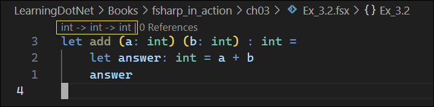

# F# In Action


<details>

<summary>Book Resources</summary>

- [Book Code](https://github.com/isaacabraham/fsharp-in-action)
</details>


<!-- omit in toc -->
## DotNet Commands
```cmd
# Create a new solution
dotnet new sln --name HelloFSharp

# Create a new F# project
dotnet new console -lang F# -o HelloFSharp

# Add the project to the solution
dotnet sln add HelloFSharp

# Run the project
dotnet run

# Start the FSI (F# Interactive) REPL
dotnet fsi
```

<!-- omit in toc -->
## Contents

- [1. Introducing F#](#1-introducing-f)
  - [About F# and Functional Programming](#about-f-and-functional-programming)
    - [Imperative Code vs Declarative Code](#imperative-code-vs-declarative-code)
    - [Composability](#composability)
    - [Data and behavior](#data-and-behavior)
  - [A smarter compiler](#a-smarter-compiler)
  - [F# and .NET](#f-and-net)
- [2. Hands on with F#](#2-hands-on-with-f)
  - [2.5 REPL and F# Scripts](#25-repl-and-f-scripts)
  - [2.5 F# Scripts](#25-f-scripts)
    - [2.5.4 State inthe REPL](#254-state-inthe-repl)
    - [2.5.5 Creating your first function](#255-creating-your-first-function)
  - [2.6 Where scripts and the REPL fit in](#26-where-scripts-and-the-repl-fit-in)
- [3. F# Syntax Basics](#3-f-syntax-basics)
  - [3.1 F# syntax basics](#31-f-syntax-basics)
    - [3.1.1 Characteristics of F# syntax](#311-characteristics-of-f-syntax)
      - [Readability](#readability)
      - [Sensible defaults](#sensible-defaults)
      - [Consistency](#consistency)
      - [A worked example](#a-worked-example)
    - [3.1.2 The `let` keyword](#312-the-let-keyword)
    - [3.1.3 Scoping](#313-scoping)
      - [Curly brace vs whitespace indention](#curly-brace-vs-whitespace-indention)
      - [Nested scopes](#nested-scopes)
      - [Nested functions](#nested-functions)
      - [Accessing outer scoped values](#accessing-outer-scoped-values)
      - [Cyclical dependencies](#cyclical-dependencies)
  - [3.2 Type Inference](#32-type-inference)
    - [3.2.1 Benefits of type inference](#321-benefits-of-type-inference)
    - [3.2.2 Type inference basics](#322-type-inference-basics)
    - [3.2.3 Inferring generics](#323-inferring-generics)
      - [Automatic Generalization](#automatic-generalization)
    - [3.2.4 Diagnosing unexpected type inference](#324-diagnosing-unexpected-type-inference)
    - [3.2.5 Limitations of type inference](#325-limitations-of-type-inference)
    - [3.2.6 Criticisms of type inference](#326-criticisms-of-type-inference)
- [4. F# Fundamentals](#4-f-fundamentals)
  - [4.1 Expressions](#41-expressions)
    - [4.1.1 Purity and side effects](#411-purity-and-side-effects)


## 1. Introducing F#

### About F# and Functional Programming


> To use F# effectively, quoting Yoda, "you must unlearn what you have learned."


**F# Mental Model:**  


#### Imperative Code vs Declarative Code

We are used to writing imperative code. F# is a functional-first language, which uses declarative code. According to the author, "if you're used to imperative model of developing, it can feel like giving up control. However, once you're used to [functional programming], it's very difficult to go back."

- Imperative code - the low-level "how", which focuses on step-by-step instructions.
- Declarative code - the high-level "what", which focuses on the end result, leaving the low-level details to the compiler


In the example above, the imperative version takes ownership of *how* we want to
filter the numbers&mdash;by creating an intermediary list, iterating through
each one, etc.

#### Composability

Functions are the main component of F# programs, rather than classes. F#
emphasizes composition over inheritance, which is a common theme in functional
programming. This means that you can build complex functions by combining
simpler ones, rather than relying on a rigid class hierarchy.


#### Data and behavior

A key pattern in F# is the separation of data and behavior. In F#, you typically
define your data types separately from the functions that operate on them.
Instead of having classes that encapsulate both data and behavior, you define
simple data types with modules of functions that operate on them.

In the OO world, you might have a `Basket` class with methods like `AddItem`,
`Clear`, and `Checkout`, plus the internal *encapsulated* state, i.e. what items
are in the basket. When you call methods on them, they would perform some action
and modify that internal state.

In the FP world, you have an *immutable* record that stores the *current* state
of the basket and a module with *stateless* functions such as `AddItem`,
`Clear`, and `Checkout`. Each function performs some action and returns an
updated version of the basket, rather than modifying the original one. This
generally leads to more predictable and testable code.

### A smarter compiler

F# inevitably changes how you write code. F# helps a great deal in reducing
boilerplate activities.

F# encourages a safer, more deliberate coding style by making it impossible to
ignore changes to your types—your code won’t compile until every usage is
updated. This eliminates a whole class of bugs (like null reference exceptions)
*at compile time* without relying on unit tests. The result is fewer runtime
surprises and less debugging, all thanks to the compiler doing more of the work
for you.

### F# and .NET

- You can reference any .NET assembly from F#
- You can consume and create classes with inheritance, interfaces, properties, and methods
- F# permits you to mix both FP and OO styles


## 2. Hands on with F#


```fsharp
let name = "Greg"
let time = System.DateTime.UtcNow
printfn $"Hello from F#! My name is {name}, the time is {time}"
```

See [HelloFSharp](./ch02/HelloFSharp/Program.fs) for the code.


### 2.5 REPL and F# Scripts

- Use F# Interactive (FSI) to run F# code interactively.
- FSI is a REPL (Read-Eval-Print Loop) for F#, which supports interactive coding.
- Use `dotnet fsi` command to start the REPL.


- Use two semicolons `;;` at the end to execute the text currently in the buffer.
- `val` is the default symbol expressions are bound to if you don't use `let`.

### 2.5 F# Scripts

- F# scripts are files with the `.fsx` extension.
- F# scripts do not require a project or solution and can be executed as a single file.

> When working in VS Code, use the [Ionide](https://github.com/ionide/ionide-vscode-fsharp) extension.

- With the Ionide extension, use the VS Code command `FSI: Send Selection` to send the selected code to the REPL.


#### 2.5.4 State inthe REPL

- The REPL is stateful in that it allows you to access data and arbitrarily interrogate and create new values from them.


Things to note from the above image:
- You start (or restart) the FSI using the command `FSI: Start`.
- You can execute lines using `FSI: Send Line`.
- You can directly execute commands in the console, but you need to use `;;` to terminate the command.

#### 2.5.5 Creating your first function

The following function takes in someone's name and age and returns a string that's a greeting of the person.

```fsharp
let greetPerson name age =
    $"Hello {name}. You are {age} years old."

greetPerson "Fred" 21
```


**Note:**  
- `a` and `b` represent *generic* types, indicating `name` and `age` can be of any type&mdash;string, integer, or customer.
- Use the command `FSI: Send Selection` to send the selected code to the REPL.

### 2.6 Where scripts and the REPL fit in

A lot of development can be done using scripts, particularly in the exploratory phase, where you create a new module or component in your application and want to start by sketching a rough idea before formalizing it.


Typically, you start with a script and then port it into a full application, whether that application be console, background service, web application, etc. From there, you establish end-to-end tests and regression test. Furthermore, the author notes that no test-driven development is needed.

## 3. F# Syntax Basics

### 3.1 F# syntax basics

#### 3.1.1 Characteristics of F# syntax

F#'s syntax goal is to be highly succint and highly safe. Most fans of dynamic languages complain that the syntax of statically typed languages is too verbose. Fans of statically typed languages point out that refactoring is difficult without a type checker and compiler and potentially affects scaling a team without writing a large number of unit tests.

F# hits a sweet spot between the two: it's lightweight, readable, and type-safe all at the same time.

In terms of syntax, F# is succinct in that it strips away unnecessary symbols and keywords that other languages rely on, resulting in code having a far greater percentage of text relating to business logic than syntax.

##### Readability

F# has a relatively small number of symbols and characters needed for different features. For example, instead of negation being `!`, F# uses `not`. This lightweight syntax makes it easy to create a *domain specific language* and write code for nontechnical people.

##### Sensible defaults

F# has defaults optimized for most common cases, which means you'll spend less time writing code to satisfy the compiler.

An example of this is public vs private status. Public is the default, so you don't have to specify it. In C#, you have to specify `public`.

##### Consistency 

Functions and values are declared using the same pattern and syntax:

```fsharp
let myFunction arg1 arg2 =  // A function definition, taking in two arguments, arg1 and arg2 (implementation omitted)
let mySimpleValue = 99      // The definition of mySimpleValue, an integer
```
**Note:** both use `let` to declare a value or function. 

##### A worked example

```fsharp
let addTenThenDouble theNumber =                            // 1.
    let addedTen = theNumber + 10                           // 2.
    let answer = addedTen * 2                               // 3.
    printfn $"({theNumber} + 10) * 2 is {answer}"           // 4.
    let website = System.Uri "https://fsharp.org"
    answer                                                  // 5.
```
**Note:**
1. *No parentheses*: F# uses parentheses in a few places, but they are usually not required to signify the start and end of arguments to a function.
2. *No curly braces*: F# is whitespace-sensitive and expects all lines within any scope to start at the same column.
3. *No semicolons*: F# doesn't require semicolons to terminate lines. 
4. *No `new` keyword*: F# thinks of a constructor on a type as a static function instead of as some kind of unique construct.
5. *No `return` keyword*: The last expression of a function is automatically the return value; therefore, there is no need to use the `return` keyword.
6. *No type annotations*: F# doesn't require any guidance from you for the types of values, yet it is a type-safe language.

#### 3.1.2 The `let` keyword

The `let` keyword is the most important keyword in F#. It allows you to bind values to symbols.

```fsharp
let doACalculation theNumber =                          // Binds a function to the symbol doACalculation
    let twenty = 20                                     // Binds the value 20 to the symbol twenty 
    let answer = twenty + theNumber                     // Binds the result of the calculation to the symbol answer
    let foo = System.Uri "https://www.fsharp.org"       // Binds a System.Uri object to the symbol foo
    answer                                              
```

**Note:** Functions are just values. Some values take in arguments, and others don't. You can treat them the same way, i.e. you can pass them around in your application as arguments, bind them to symbols, and so on. 

Think of `let` as a copy and paste instruction: whenever you see this symbol used in code, replace it with the value on the right-hand side of the `=` sign. 

```fsharp
let isaac = 42                  // Binds the value 42 to the symbol isaac
let olderIsaac = isaac + 1      // References the symbol isaac to get the value 42
let youngerIsaac = isaac - 1
```

Code above becomes:

```fsharp
let olderIsaac = 42 + 1
let youngerIsaac = 42 - 1
```

**Note:** Some languages use the `var` keyword to perform what appears to be the same thing as `let`, but this is not the case. `var` declares variables, which can vary by being assigned different values or by being mutated. `let` creates an immutable reference to a value. Once you've bound a value to a symbol, you can't change it to reference another value later.

#### 3.1.3 Scoping

In F# terms, scoping means the lifetime in which other parts of code can reference a symbol.

##### Curly brace vs whitespace indention

Take the following fictional F# function `foo` styles:

```fsharp
let foo arg1 arg2 arg3 =
  body
  body
  body
```
**Note:**
- F# uses whitespace indentation to signify the start and end of a scope, rather than curly braces.
- F# doesn't allow the use of tabs as a valid token

**Exercise 3.1:** Create a function that takes in three numbers as input arguments. Add the first two together and bind it to a symbol inProgress. Then, multiply that by the third argument and bind it to a symbol answer. Finally, return a string that says The answer is {answer} using string interpolation.

```fsharp
let foo num1 num2 num3 =
    let inProgress = num1 + num2
    let answer = inProgress * num3
    $"The answer is {answer}"
```
**Output:**
```cmd
> #load "Ex_3.1.fsx";;
[Loading c:\Users\gregt\LocalCode\LearningDotNet\Books\fsharp_in_action\ch03\Ex_3.1.fsx]
module FSI_0007.Ex_3.1
val foo: num1: int -> num2: int -> num3: int -> string

> foo 2 3 4;;
val it: string = "The answer is 20"
```

##### Nested scopes

Nested scopes are rarely used in curly brace languages, but they are common in F# to create arbitrary scopes inside of scopes. They are useful because they allow you to clearly indicate to the reader the scope of a piece of data.

The more tightly scoped a value is, the less of a chance of it being misused, leading to bugs.

```fsharp
let fname = "Frank"
let sname = "Schmidt"
let fullName = $"{fname} {sname}"               // Uses two previously defined symbols to create a third
let greetingText = $"Greetings, {fullname}"     // Uses the previously defined symbol to create a fourth
```
**Note:**
- `fname` and `sname` are only used to create `fullName`, so they are tightly scoped.
- Similarly, `fullName` is only used to create `greetingText`, so it is tightly scoped.

Rewriting the above code to use nested scopes:

```fsharp
let greetingText =              // Outermost scope
  let fullName =                // Nested scope
    let fname = "Frank"         // Intermediary symbols only accessible within scope of `fullName` block
    let sname = "Schmidt"
    $"{fname} {sname}"
  $"Greetings, {fullName}"
```

##### Nested functions

```fsharp
let greetingTextWithFunction person =
  let makeFullName fname sname =
    $"{fname} {sname}"
  let fullName = makeFullName "Frank" "Schmidt"
  $"Greetings {fullName} from {person}"
```

##### Accessing outer scoped values

If you declare a symbol before a nested scope, you can access it from within the nested scope:

```fsharp
let greetingTextWithFunction =
  let city = "London"                               // declares symbol in outer scope
  let makeFullName fname sname =
    $"{fname} {sname} from {city}"                  // accesses city within inner scope (closure)
  let fullName = makeFullName "Frank" "Schmidt"
  let surnameCity = $"{sname} from {city}"
  $"Greetings {fullName}"
```

##### Cyclical dependencies

Except in advanced scenarios, F# does not allow you to reference a symbol unless you've already declared it:

```fsharp
let description = $"{employee} lives in New York"       // Error: employee not yet defined
let employee = "Joe Bloggs"        
```

In short, F# requires all symbols to be defined before use. This ensures non-circular dependencies.

### 3.2 Type Inference

The general idea behind type inference: instead of you having to tell the compiler the type of every symbol (remember that F# is statically typed), the compiler should be able to figure it out for you.

#### 3.2.1 Benefits of type inference

Benefits:
- Easier to read&mdash;there's less extraneous code.
- Quicker to write&mdash;you type less while you're writing, allowing the compiler to deduce what you're doing.
- Quicker to refactor&mdash;you can make changes without having to make boilerplate changes throughout.

C# uses the `var` keyword for type inference.

#### 3.2.2 Type inference basics

```fsharp
let i = 10          // No type annotation
let i:int = 10      // Type annotation
```
In F#, a type annotation goes after the symbol name. Most newer programming languages (e.g. Go, Rust, TypeScript, Kotlin) follow this pattern. Older programming languages (e.g. Java, JavaScript, C#, C++) use the type before the symbol name.

In VS Code, the following setting enables type annotations: `"FSharp.inlayHints.typeAnnotations": true,`


You can also also use the following setting to have type annotations appear after the statement: `"FSharp.lineLens.enabled": "replaceCodeLens"`


```fsharp
let add (a:int) (b:int) : int =     // three explicit type annotations: the two function arguments and the return value
    let answer : int = a + b        // a fourth type annotation
    answer
```
**Note:** Parenthesis are required when making explicit type annotations for parameters.

<br>

**Exercise 3.2:** Complete the following steps to see some basic type inference in action:

1. Enter the code from listing 3.4 into an empty F# script file. 

```fsharp
let add (a: int) (b: int) : int =
    let answer: int = a + b
    answer
```

2. Observe that the CodeLens correctly identifies the type signature of the add function. 



3. Remove the return type annotation (: int) so that the function declaration is let add (a:int) (b:int)

```fsharp
let add (a: int) (b: int) =
    let answer: int = a + b
    answer
```

4. Observe that the CodeLens still correctly indicates that the function returns an integer. 


5. Remove the type annotation from answer. 

```fsharp
let add (a: int) (b: int) =
    let answer = a + b
    answer
```

6. Observe that the CodeLens still correctly understands that the function returns an integer. 


7. Remove the type annotation from b (you can also remove the parenthesis around it). 

```fsharp
let add (a: int) b =
    let answer = a + b
    answer
```
8. Observe that the CodeLens still correctly understands that b is an integer. 


9.  Remove the type annotation from a (you can also remove the parenthesis around it). 

```fsharp
let add a b =
    let answer = a + b
    answer
```
10. Observe that the CodeLens still correctly understands that a is an integer.


The compiler assumes `a` and `b` are integers because `int` is the default for numeric operations in F#. If you had annotated one of the elements as a string, which still supports the `+` operator, the compiler would have inferred that both `a` and `b` are strings.


In function declarations, why do you need parentheses around a parameter that uses type annotations?

```fsharp
let add a (b: int) : int =
```

To avoid ambiguity during parsing. If you wrote it like this:

```fsharp
let add a b: int = 
```

F# would interpret it incorrectly&mdash;as if you're assigning a return type to the function, not specifying the parameter type for `b`. It would be parsed as:

```fsharp
let add (a) (b) : int =
```

<br>

**Exercise 3.3:** 

1. Add the string hello to a + b on line 3. What happens? 

```fsharp
let add a b =
    let answer = a + b + "Hello"
    answer
```
The compiler now infers that `a` and `b` are both strings, because the `+` operator is being used with a string.


2. Add a type annotation of string to the return type of the function. What happens? 

```fsharp
let add a b : string =
    let answer = a + b
    answer
```


3. Explicitly annotate b as an integer again and add 13.34 (which is a float, not an int) to a + b on line 3. What happens?

```fsharp
let add a (b:int) : string =
    let answer = a + b + 13.34
    answer
```

Compiler error:  


<br>

#### 3.2.3 Inferring generics

Generics allow you to create types and functions that can operate on any type rather than being bound to a specific concrete type.

```fsharp
let explicit = ResizeArray<int>()       // Creates a resizable array of ints with an explicit generic type argument
let typeHole = ResizeArray<_>()         // Creates a resizable array of ints using the underscore as a typeHole
let omitted = ResizeArray()             // Creates a resizable array of ints omitting the generic argument completely

typeHole.Add 99                         // typeHole now becomes ResizeArray<int>
omitted.Add 10
```

The typehole is represented by an underscore (_) and acts as a placeholder that tells the compiler "figure this out for me based on usage". It provides safe inference. Contrast this with the omitted generic argument, which is not type-safe and can lead to runtime errors.

**Exercise 3.4:** Change the value 10 to a string. What happens to the type of omitted? Note that if the compiler can’t infer the generic type argument because there’s no usage of the list, it will infer the type argument as Object, although the compiler will actually throw an error forcing you to add type annotations.

```fsharp
let explicit = ResizeArray<int>()
let typeHole = ResizeArray<_>()
let omitted = ResizeArray()

typeHole.Add 99
omitted.Add "this is a string"
```

The type of `ommitted` becomes `ResizeArray<string>`:


##### Automatic Generalization

If F# determines an argument to a function is generic, it will automatically generalize your functions.

```fsharp
let combineElements<'T> (a:'T) (b:'T) (c:'T) =      // Specifies a generic type parameter 'T on the function
    let output = ResizeArray<'T>()                  // Creates a resize array of type 'T
    output.Add a
    output.Add b
    output.Add c
    output

combineElements<int> 1 2 3                          // Calls the function to combine three numbers
```
**Note:** The single quote before the type parameter `'T` is F# syntax to denote a type variable&mdash;a placeholder for a type that will be inferred later.

Automatic generalization means that you can do away with all type annotations and let the compiler infer the types for you:

```fsharp
let combineElements a b c =                         // Lets the compiler generalize the function for us
    let output = ResizeArray()
    output.Add a
    output.Add b
    output.Add c
    output

combineElements 1 2 3                               // Calls the automatically generalized function
```
The author recommends letting the compiler automatically generalize your functions, as it will infer the types based on usage. On the rare occasion, you can add explicit type annotations as needed.

#### 3.2.4 Diagnosing unexpected type inference

Consider the following two functions:

```fsharp
let calculateGroup age =                                // Has the signature int -> string
    if age < 18 then "Child"
    elif age < 65 then "Adult"
    else "Pensioner"

let sayHello someValue =                                // Has the signature float -> string
    let group =                                         // The string result of calling calculateGroup
        if someValue < 10.0 then calculateGroup 15
        else calculateGroup 35
    "Hello " +  group

let result = sayHello 10.5
```


**Output:**

```cmd
> # 1 @"LocalCode\LearningDotNet\Books\fsharp_in_action\ch03\DiagnosingInferenceBehavior.fsx"
- let calculateGroup age =
-     if age < 18 then "Child"
-     elif age < 65 then "Adult"
-     else "Pensioner"
-
- let sayHello someValue =
-     let group =
-         if someValue < 10.0 then calculateGroup 15
-         else calculateGroup 35
-     "Hello " +  group
-
- let result = sayHello 10.5;;
val calculateGroup: age: int -> string
val sayHello: someValue: float -> string
val result: string = "Hello Adult"
```

Note how the type inference engine correctly figures out all the types for the functions.

If you change `18` to `"test"` in the `calculateGroup` function, the compiler will generate a number of errors:


Note how the function signature for `calculateGroup` has changed to `string -> string`, which is not what we want. The compiler has inferred that the type of `age` is a string, which is incorrect.

The F# compiler uses the first opportunity it gets to infer the type of a value. 

You can guide the compiler by temporarily putting an explicit integer type annotation against `age`:

```fsharp
let calculateGroup (age:int) =
    if age < "test" then "Child"
    elif age < 65 then "Adult"
    else "Pensioner"
```
In this case, the compiler correctly shows a compiler error on the comparison test:


#### 3.2.5 Limitations of type inference

There are a few areas where type inference doesn't work, and you'll have to use explicit type annotations. These cases are around the object-oriented features of F#. So, any classes you create or refrence from C# won't be inferred based on member access. This includes essentially all of the framework class library.

Once the compiler has identified a type, it can use that information for inference further downstream:

```fsharp
let addThreeDays (theDate:System.DateTime) =            // Type annotation required for the DateTime type
    theDate.AddDays 3

let addAYearAndThreeDays theDate =                      // Type annotation note required
    let threeDaysForward = addThreeDays theDate         // Usage point for type inference
    theDate.AddYears 
```

#### 3.2.6 Criticisms of type inference

The most commmon criticisms of type inference are:
1. It's "magic"
2. One can't determine the type of a variable without an annotation
3. You lose semantic meaning without an annotation (i.e. you can't easily see the intent or meaning of code without types)

The compiler doesn't guess types but instead uses a clearly defined set of precedence rules. All the issues with type inference can be followed through until one point in your codebase where a type clashes and leads to a compiler error.

Modern IDEs give both tooltips or a code lens that shows the type of a symbol, so you can easily see what the type is without having to add an annotation.

The following code conveys the intent of the code without needing to add type annotations:

```fsharp
let x = getData()                                       // No type annotations, poor naming
let x:Customer list = getData()                         // Type annotation, poor naming
let customersToRemind = loadOverDueCustomers()          // No type annotations, good naming
```

The author advises not to bother with type annotations. 

Type inference fits with the "more with less" philosophy of F# and the idea of trusting the compiler to do its job. Type inference is incredibly useful in writing succinct, easily rfactorable code without needing a third-party tool to rewrite your code for you.

## 4. F# Fundamentals

Two core features of F# will have a large effect on how you write and design code:  expressions and immutability.

Both features go hand-in-hand: without one, the other woudn't be especially useful. 

Both are designed to change the way you write code into one that's oriented around working with values and applying transformations to those values as the basic mechanism of implementing logic.

### 4.1 Expressions

Expressions vs. Statements

|             | Returns Something? | Has side-effects? |
| ----------- | ------------------ | ----------------- |
| Expressions | Always             | Occassionally     |
| Statements  | Never              | Always            |

#### 4.1.1 Purity and side effects

**Purity**

A *pure* function is a function that doesn't have any side effects and is guaranteed to always give the same output for a given input.

Pure functions are easy to test; you only have to worry about giving it some inputs and checking the return value. You don't have to check whether some internal, encapsulated state has been modified or a file has been written; it's just inputs and outputs.

Some functional programming languages, such as Haskell, enforce functional purity. F# doesn't provide any gurantees over pure functions, but it does have some features to help you identify functions that are not pure.

**Side Effect**  

A side effect is typically some effect that a function has on data that exists outside of itself. This could be writing to a database table or modifying some global mutable state. 

Side effects can't be observed from a function's signature (i.e. its inputs or outputs) and so can be harder to test. Instead, you may need to observe side effects by calling other methods on an object and confirming that its behavior has changed or looking to see if a row was added to a database table.
