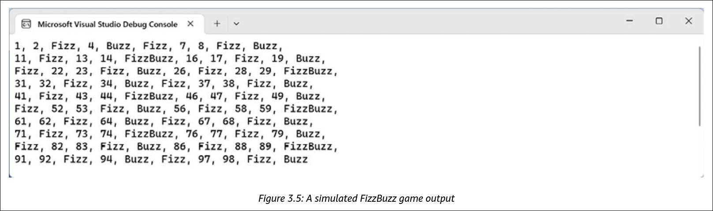
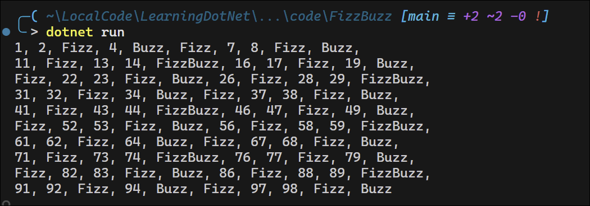

<!-- omit in toc -->
# Chapter 3: Controlling Flow, Converting Types, and Handling Exceptions
- [Operating on Variables](#operating-on-variables)
  - [Postfix and prefix operators:](#postfix-and-prefix-operators)
  - [Binary arithmetic operators](#binary-arithmetic-operators)
  - [Assignment Operators](#assignment-operators)
  - [Null-coalescing Operators](#null-coalescing-operators)
  - [Logical operators](#logical-operators)
  - [Conditional logical operators](#conditional-logical-operators)
  - [Bitwise and binary shift operators](#bitwise-and-binary-shift-operators)
  - [Miscellaneous operators](#miscellaneous-operators)
- [Understanding selection statements](#understanding-selection-statements)
  - [Pattern matching with the `if` statement](#pattern-matching-with-the-if-statement)
  - [Branching with the `switch` statement](#branching-with-the-switch-statement)
  - [Pattern matching with the `switch` statement](#pattern-matching-with-the-switch-statement)
  - [Simplifying switch statements with switch expressions](#simplifying-switch-statements-with-switch-expressions)
- [Understanding iteration statements](#understanding-iteration-statements)
  - [Looping with the while statement](#looping-with-the-while-statement)
  - [Looping with the do statement](#looping-with-the-do-statement)
  - [Looping with the for statement](#looping-with-the-for-statement)
  - [Looping with the foreach statement](#looping-with-the-foreach-statement)
    - [Understanding how foreach works internally](#understanding-how-foreach-works-internally)
- [Storing muliple values in an array](#storing-muliple-values-in-an-array)
  - [Single-dimensional arrays](#single-dimensional-arrays)
  - [Multi-dimensional arrays](#multi-dimensional-arrays)
  - [List pattern matching with arrays](#list-pattern-matching-with-arrays)
  - [Trailing commas](#trailing-commas)
  - [Understanding inline arrays](#understanding-inline-arrays)
  - [Summarizing arrays](#summarizing-arrays)
- [Casting and converting between types](#casting-and-converting-between-types)
  - [Casting numbers implicitly and explicitly](#casting-numbers-implicitly-and-explicitly)
  - [How negative numbers are represented in binary](#how-negative-numbers-are-represented-in-binary)
  - [Converting with the `System.Convert` type](#converting-with-the-systemconvert-type)
    - [Rounding numbers and the default rounding rules](#rounding-numbers-and-the-default-rounding-rules)
    - [Taking control of rounding rules](#taking-control-of-rounding-rules)
  - [Converting from any type to a string](#converting-from-any-type-to-a-string)
  - [Converting from a binary object to a string](#converting-from-a-binary-object-to-a-string)
  - [Base64 for URLs](#base64-for-urls)
  - [Parsing from strings to numbers or dates and times](#parsing-from-strings-to-numbers-or-dates-and-times)
  - [Avoid Parse exceptions by using the TryParse method](#avoid-parse-exceptions-by-using-the-tryparse-method)
  - [Understanding the Try method naming convention](#understanding-the-try-method-naming-convention)
- [Handling exceptions](#handling-exceptions)
  - [Wrapping error-prone code in a try block and using the null-forgiving operator](#wrapping-error-prone-code-in-a-try-block-and-using-the-null-forgiving-operator)
  - [Catching specific exceptions](#catching-specific-exceptions)
  - [Catching specific exceptions](#catching-specific-exceptions-1)
  - [Catching with filters](#catching-with-filters)
  - [Checking for overflow](#checking-for-overflow)
    - [Throwing overflow exceptions with the checked statement](#throwing-overflow-exceptions-with-the-checked-statement)
    - [Disabling compiler overflow checks with the unchecked statement](#disabling-compiler-overflow-checks-with-the-unchecked-statement)
  - [Returning result types versus throwing exceptions](#returning-result-types-versus-throwing-exceptions)
    - [Exceptions in .NET](#exceptions-in-net)
    - [Result Types in .NET](#result-types-in-net)
    - [Libraries Available to Implement Result Types](#libraries-available-to-implement-result-types)
    - [Discriminated Unions and Their Relation to the Discussion](#discriminated-unions-and-their-relation-to-the-discussion)
    - [Conclusion on Exceptions vs. Result Types](#conclusion-on-exceptions-vs-result-types)
  - [Exercises](#exercises)
    - [Practice loops and operators](#practice-loops-and-operators)
    - [Practice exception handling](#practice-exception-handling)


## Operating on Variables

### Postfix and prefix operators:

```csharp
int a = 3;
int b = a++;            // postfix increment operates after the value is assigned
WriteLine($"a is {a}, b is {b}");
```
```cmd
dotnet run
a is 4, b is 3
```

```csharp
int c = 3;
int d = ++c;            // prefix increment operates before the value is assigned
WriteLine($"c is {c}, d is {d}");
```
```cmd
dotnet run
c is 4, d is 4
```

### Binary arithmetic operators

```csharp
int e = 11;
int f = 3;
WriteLine($"e is {e}, f is {f}");
WriteLine($"e + f = {e + f}");
WriteLine($"e - f = {e - f}");
WriteLine($"e * f = {e * f}");
WriteLine($"e / f = {e / f}");
WriteLine($"e % f = {e % f}");
```
```cmd
dotnet run
e is 11, f is 3
e + f = 14
e - f = 8
e * f = 33
e / f = 3
e % f = 2
```
```csharp
WriteLine($"g is {g:N1}, f is {f}");
WriteLine($"g / f = {g / f}");
```
```cmd
dotnet run
g is 11.0, f is 3
g / f = 3.6666666666666665
```

### Assignment Operators

```csharp
int p = 6;
p += 3;     // equivalent to p = p + 3
p -= 3;     // equivalent to p = p - 3
p *= 3;     // equivalent to p = p * 3
p /= 3;     // equivalent to p = p / 3
```

### Null-coalescing Operators

```csharp
string? authorName = GetAuthorName(); // A fictional function.

// The maxLength variable will be the length of authorName if it is
// not null, or 30 if authorName is null.
int maxLength = authorName?.Length ?? 30;

// The authorName variable will be "unknown" if authorName was null.
authorName ??= "unknown";
```

### Logical operators

```csharp
bool p = true;
bool q = false;
WriteLine($"AND  | p     | q    ");
WriteLine($"p    | {p & p,-5} | {p & q,-5} ");
WriteLine($"q    | {q & p,-5} | {q & q,-5} ");
WriteLine();
WriteLine($"OR   | p     | q    ");
WriteLine($"p    | {p | p,-5} | {p | q,-5} ");
WriteLine($"q    | {q | p,-5} | {q | q,-5} ");
WriteLine();
WriteLine($"XOR  | p     | q    ");
WriteLine($"p    | {p ^ p,-5} | {p ^ q,-5} ");
WriteLine($"q    | {q ^ p,-5} | {q ^ q,-5} ");
```
```cmd
dotnet run
AND  | p     | q    
p    | True  | False 
q    | False | False

OR   | p     | q
p    | True  | True
q    | True  | False

XOR  | p     | q
p    | False | True
q    | True  | False
```
**Note:** the `-5` in the format string specifies that the output should be left-aligned within a width of 5 characters.

### Conditional logical operators

```csharp
static bool DoStuff() { return true; }

bool p = true;
bool q = false;

WriteLine($"p & DoStuff() = {p & DoStuff()}");          // p & DoStuff() = True
WriteLine($"q & DoStuff() = {q & DoStuff()}");          // q & DoStuff() = False, DoStuff() is called

WriteLine($"p && DoStuff() = {p && DoStuff()}");        // p && DoStuff() = True
WriteLine($"q && DoStuff() = {q && DoStuff()}");        // q && DoStuff() = False, DoStuff() is not called
```

### Bitwise and binary shift operators

```csharp
WriteLine($"Expression | Decimal | Binary");
WriteLine($"-------------------------------------");
WriteLine($"x          | {x,7} | {x:B8}");
WriteLine($"y          | {y,7} | {y:B8}");
WriteLine($"x & y      | {x & y,7} | {x & y:B8}");
WriteLine($"x | y      | {x | y,7} | {x | y:B8}");
WriteLine($"x ^ y      | {x ^ y,7} | {x ^ y:B8}");
WriteLine($"x << 3     | {x << 3,7} | {x << 3:B8}");
WriteLine($"x * 8      | {x * 8,7} | {x * 8:B8}");
WriteLine($"y >> 1     | {y >> 1,7} | {y >> 1:B8}");
```
```cmd
dotnet run

Expression | Decimal | Binary
-------------------------------------
x          |      10 | 00001010
y          |       6 | 00000110
x & y      |       2 | 00000010
x | y      |      14 | 00001110
x ^ y      |      12 | 00001100
x << 3     |      80 | 01010000
x * 8      |      80 | 01010000
y >> 1     |       3 | 00000011
```
**Note:** The `B8` format specifier formats the number as a binary string with 8 digits, padding with leading zeros if necessary.

When operating on integers, `&` and `|` are bitwise operators. When operating on booleans, they are logical operators. 

### Miscellaneous operators

`nameof` and `sizeof` are convention when working with types:
- `nameof` returns the short name of a variable, type, or member as a `string` value, which is useful when outputting debugging messages.
- `sizeof` returns the size in bytes of simple types, which is useful for determining the efficiency of data storage.

Technically, the `sizeof` operator requires an `unsafe` code block, but the sizes of value types with a C# alias, like `int` and `double`, are hardcoded as constants by the compiler, so they do not need an unsafe block.

```csharp
int age = 50;
WriteLine($"The {nameof(age)} variable uses {sizeof(int)} bytes of memory.");
```
```cmd
dotnet run
The age variable uses 4 bytes of memory.
```

There are other operators:
- The `.` between a variable and its members is the **member access operator**.
- The round brackets at the end of a function or method name are the **invocation operator**.

```csharp
int age = 50;

// How many operators in the following statement?
char firstDigit = age.ToString()[0];

// There are four operators:
// = is the assignment operator
// . is the member access operator
// () is the invocation operator
// [] is the indexer access operator
```

## Understanding selection statements

### Pattern matching with the `if` statement

C# 7 introduced pattern matching with the `if` statement. The expression, `o is int i`, does two things:
1. Checks the type of data in a variable `o` to see if it is an `int`.
2. If it is an `int`, it assigns the value to a new variable `i` that is scoped to the `if` block.

```csharp
object o = "3";
int j = 4;
if (o is int i)         // Pattern matching to check if o is an int
{
    WriteLine($"{i} x {j} = {i * j}");
}
else
{
    WriteLine("o is not an int so it cannot multiply!");
}
```
```cmd
dotnet run
o is not an int so it cannot multiply!
```

But changing the type of `o` to an `int` will change the output:

```csharp
object o = 3;
int j = 4;
if (o is int i)
{
    WriteLine($"{i} x {j} = {i * j}");
}
else
{
    WriteLine("o is not an int so it cannot multiply!");
}
```
```cmd
dotnet run
3 x 4 = 12
```

### Branching with the `switch` statement

In the `switch` statement, every `case` section must end with one of the following:
- The `break` keyword.
- The `goto case` keyword to jump to another case.
- No statements
- The `goto` keyword that references a named label.
- The `return` keyword to leave the current function.

```csharp
// Inclusive lower bound but exclusive upper bound.
int number = Random.Shared.Next(minValue: 1, maxValue: 7);
WriteLine($"My random number is {number}");
switch (number)
{
  case 1:
    WriteLine("One");
    break;                  // Jumps to end of switch statement.
  case 2:
    WriteLine("Two");
    goto case 1;
  case 3:                   // Multiple case section.
  case 4:
    WriteLine("Three or four");
    goto case 1;
  case 5:
    goto A_label;
  default:
    WriteLine("Default");
    break;
}                           // End of switch statement.
WriteLine("After end of switch");
A_label:
WriteLine($"After A_label");
```
```cmd
dotnet run
My random number is 3
Three or four
One
After end of switch
After A_label
```
```cmd
dotnet run
My random number is 1
One
After end of switch
After A_label
```
```cmd
dotnet run
My random number is 5
After A_label
```

**Good Practice:** Use the `goto` keyword to jump to another case or label. The `goto` keyword is frowned upon by most programmers but can be a good solution to code logic in some scenarios. However, you should use it sparingly, if at all. See [here](https://github.com/search?q=%22goto%20%22+repo%3Adotnet%2Fruntime+language%3AC%23&type=code&ref=advsearch) for how often Microsoft uses `goto` in the .NET base class libraries.

### Pattern matching with the `switch` statement

Similar to the `if` statement, the `switch` statement can also use pattern matching. The case values no longer need to be literal values; they can be patterns.

In C# 7, your code can more concisely branch, based on the subtype of a class, and you can declare and assign a local variable to safely use it.

`case` statements can also use the `when` keyword to add a condition that must be true for the case to match.

A simple class hierarhy to illustrate the use of pattern matching with subclasses:
```csharp
class Animal
{
    public string? Name;            // Allows null values
    public DateTime Born;
    public byte Legs;
}
class Cat : Animal
{
    public bool IsDomestic;
}
class Spider : Animal
{
    public bool IsVenomous;
}
```
```csharp
var animals = new Animal?[]         // Allows null values in the array
{
    new Cat {Name = "Karen", Born = new(year:2022, month:6, day:12)},
    null,
    new Cat {Name = "Mufasa", Born = new(year:1994, month:6, day:12)},
    new Spider {Name = "Sid Vicious", Born = DateTime.Today, IsVenomous = true},
    new Spider {Name = "Captain Furry", Born = DateTime.Today},
};

foreach (Animal? animal in animals)
{
    string message;
    switch (animal)
    {
        // Can be written more concisely as "case Cat {Legs:4} fourLeggedCat:"
        case Cat fourLeggedCat when fourLeggedCat.Legs == 4:        
            message = $"The cat named {fourLeggedCat.Name} has four legs.";
            break;
        case Cat wildCat when wildCat.IsDomestic == false:
            message = $"The non-domestic cat is named {wildCat.Name}.";
            break;
        case Cat cat:
            message = $"The cat is named {cat.Name}.";
            break;
        default: // default is always evaluated last; placed it in the middle deliberabately to illustrate this behavior.
            message = $"{animal.Name} is a {animal.GetType().Name}";
            break;
        case Spider spider when spider.IsVenomous:
            message = $"The {spider.Name} spider is venomous. Run!";
            break;
        case null:
            message = $"The animal is null.";
            break;
    }
    WriteLine($"switch statement: {message}");
}
```
```cmd
dotnet run
switch statement: The non-domestic cat is named Karen.
switch statement: The animal is null.
switch statement: The non-domestic cat is named Mufasa.
switch statement: The Sid Vicious spider is venomous. Run!
switch statement: Captain Furry is a Spider
```

### Simplifying switch statements with switch expressions

Most `switch` statements are simple, yet they require a lot of typing. `switch` expressions allow you to simplify your code by using a lambda, `=>`, to indicate a return value.

```csharp
var animals = new Animal?[]
{
    new Cat {Name = "Karen", Born = new(year:2022, month:6, day:12)},
    null,
    new Cat {Name = "Mufasa", Born = new(year:1994, month:6, day:12)},
    new Spider {Name = "Sid Vicious", Born = DateTime.Today, IsVenomous = true},
    new Spider {Name = "Captain Furry", Born = DateTime.Today},
};

foreach (Animal? animal in animals)
{
    string message;
    message = animal switch
    {
        Cat fourLeggedCat when fourLeggedCat.Legs == 4
            => $"The cat named {fourLeggedCat.Name} has four legs.",
        Cat wildCat when wildCat.IsDomestic == false
            => $"The non-domestic cat is named {wildCat.Name}.",
        Cat cat
            => $"The cat is named {cat.Name}.",
        Spider spider when spider.IsVenomous
            => $"The {spider.Name} spider is venomous. Run!",
        null
            => $"The animal is null.",
        _ // Replace the word "default" with an underscore. 
            => $"{animal.Name} is a {animal.GetType().Name}"
    };
    WriteLine($"switch statement: {message}");
}
```

Main differences are the removal of the `case` and `break` keywords.

**Note:** The underscore is known as a **Discard**, which are placeholder values that are intentionally unused in code. A discard communicates to the compiler and others that read your code: You intended to ignore the result of the expression. See [here](https://learn.microsoft.com/en-us/dotnet/csharp/fundamentals/functional/discards) for more on Discards.

## Understanding iteration statements

### Looping with the while statement

```csharp
int x = 0;
while (x < 10)
{
    WriteLine(x);
    x++;
}
```
```cmd
dotnet run
0
1
2
3
4
5
6
7
8
9
```

### Looping with the do statement

```csharp
string? actualPassword = "Pa$$w0rd";
string? password;
do
{
    Write("Enter your password: ");
    password = ReadLine();
}
while (password != actualPassword);
WriteLine("Correct!");
```
```cmd
Enter your password: abc
Enter your password: abc
Enter your password: Pa$$w0rd
Correct!
```

### Looping with the for statement

```csharp
for (int y = 0; y <= 10; y += 3)
{
    WriteLine(y);
}
```
```cmd
dotnet run
0
3
6
9
```

### Looping with the foreach statement

```csharp
string[] names = { "Adam", "Barry", "Charlie" };
foreach (string name in names)
{
    WriteLine($"{name} has {name.Length} characters.");
}
```
```cmd
Adam has 4 characters.
Barry has 5 characters.
Charlie has 7 characters.
```

#### Understanding how foreach works internally

The `foreach` statement works on any type that follows these rules:
- The type must have a method named `GetEnumerator` that returns an object.
- The returned object must have a property named `Current` and a method named `MoveNext`.
- The `MoveNext` method must change the value of `Current` and return `true` if there are more items to enumerate through or return `false` if there are no more items.

There are interfaces named `IEnumerable` and `IEnumerable<T>` that formally define these rules, but technically, the compiler does not require the type to implement these interfaces.

The compiler turns the `foreach` statement into something like the following pseudocode:

```csharp
IEnumerator e = names.GetEnumerator();
while (e.MoveNext())
{
    string name = (string)e.Current;    // Current is read-only
    WriteLine($"{name} has {name.Length} characters.");
}
```
Because the `Current` property is read-only, the variable declared in the `foreach` statement cannot be used to modify the value of the current item.

## Storing muliple values in an array

Declare an array when you need to store multiple values of the same type.

### Single-dimensional arrays

The following code allocates memory for storing four `string` values. It then stores `string` values at index positions 0 to 3. 


```cs
string[] names;                 // This can reference any size array of strings
names = new string[4];          // Allocate memory for four strings in an array

// Assign names to each element in the array
names[0] = "Kate";
names[1] = "Jack";
names[2] = "Rebecca";
names[3] = "Tom";

// Iterate through the array and print each name with its position
for (int i = 0; i < names.Length; i++)
{
    WriteLine($"{names[i]} is at position {i}.");
}
```
```
% dotnet run
Kate is at position 0.
Jack is at position 1.
Rebecca is at position 2.
Tom is at position 3.
```
Arrays are always of a fixed size at the time of memory allocation, so you need to decide how many items you want to store before instantiating them.

**Note:** Don't assume all arrays count from zero. The most common type of array in .NET is `szArray`, a single-dimensional zero-indexed array, and these use the normal `[]` syntax. However, .NET also has `mdArray`, a multi-dimensional array, and these do not have to start at zero. 

You can also define an array using array initializer syntax, which is more concise:

```cs
string[] names2 = { "Kate", "Jack", "Rebecca", "Tom" }; // Array initializer syntax
for (int i = 0; i < names2.Length; i++)
{
    WriteLine($"{names2[i]} is at position {i}.");
}
```

### Multi-dimensional arrays

```cs
// Declare and initialize a two-dimensional string array, then print its bounds and contents
string[,] grid1 =
{
    { "Alpha", "Beta", "Gamma", "Delta" },
    { "Anne", "Ben", "Charlie", "Doug" },
    { "Aardvark", "Bear", "Cat", "Dog" }
};

// Print the lower and upper bounds of each dimension of the two-dimensional array
WriteLine($"1st dimension, lower bound: {grid1.GetLowerBound(0)}");
WriteLine($"1st dimension, upper bound: {grid1.GetUpperBound(0)}");
WriteLine($"2nd dimension, lower bound: {grid1.GetLowerBound(1)}");
WriteLine($"2nd dimension, upper bound: {grid1.GetUpperBound(1)}");

// Iterate through the two-dimensional array and print each element with its row and column
for (int row = 0; row <= grid1.GetUpperBound(0); row++)
{
    for (int col = 0; col <= grid1.GetUpperBound(1); col++)
    {
        WriteLine($"Row {row}, Column {col}: {grid1[row, col]}");
    }
} 
```
```cmd
1st dimension, lower bound: 0
1st dimension, upper bound: 2
2nd dimension, lower bound: 0
2nd dimension, upper bound: 3

Row 0, Column 0: Alpha
Row 0, Column 1: Beta
Row 0, Column 2: Gamma
Row 0, Column 3: Delta
Row 1, Column 0: Anne
Row 1, Column 1: Ben
Row 1, Column 2: Charlie
Row 1, Column 3: Doug
Row 2, Column 0: Aardvark
Row 2, Column 1: Bear
Row 2, Column 2: Cat
Row 2, Column 3: Dog
```

You must supply a value for every row and column when it is instantiated or you will get compile errors.

Use `string.Empty` if you need to indicate a missing value.

Or you can declare the array to be nullable values by using `string?[]`; then you can use `null` for a missing value.

If you cannot use array initialization syntax, perhaps because you are loading values from a file or database, you can separate the declaration of the array dimension and the allocation of memory from the assignment of values:

```cs
// Declare and initialize a jagged array (array of arrays)
string[][] jagged =
{
    new[]{"Alpha", "Beta", "Gamma"},
    new[]{"Anne", "Ben", "Charlie", "Doug"},
    new[]{"Aardvark", "Bear"}
};

// Print the upper bound of the jagged array and each sub-array
WriteLine("Upper bound of the array of arrays is: {0}", jagged.GetUpperBound(0));
for (int array = 0; array <= jagged.GetUpperBound(0); array++)
{
    WriteLine("Upper bound of array {0} is {1}", arg0: array, arg1: jagged[array].GetUpperBound(0));
}

// Iterate through the jagged array and print each element with its row and column
for (int row = 0; row <= jagged.GetUpperBound(0); row++)
{
    for (int col = 0; col <= jagged[row].GetUpperBound(0); col++)
    {
        WriteLine($"Row {row}, Column {col}: {jagged[row][col]}");
    }
}
```
```cmd
Upper bound of the array of arrays is: 2
Upper bound of array 0 is 2
Upper bound of array 1 is 3
Upper bound of array 2 is 1

Row 0, Column 0: Alpha
Row 0, Column 1: Beta
Row 0, Column 2: Gamma
Row 1, Column 0: Anne
Row 1, Column 1: Ben
Row 1, Column 2: Charlie
Row 1, Column 3: Doug
Row 2, Column 0: Aardvark
Row 2, Column 1: Bear
```

### List pattern matching with arrays

List pattern matching works with any type that has a public `Length` or `Count` property and has an indexer using an `int` or `System.Index` parameter.

When you define multiple list patterns in the same `switch` expression, you must order them so that the most specific one comes first, or the compiler will complain because a more general pattern will match the more specific pattern too, and make the more specific one unreachable.

Examples of list pattern matching:

| Example                             | Description                                                                                                                                               |
| ----------------------------------- | --------------------------------------------------------------------------------------------------------------------------------------------------------- |
| `[]`                                | Matches an empty array or collection.                                                                                                                     |
| `[..]`                              | Matches an array or collection with any number of items, including zero, so `[..]` must come after `[]` if you need to switch on both.                    |
| `[_]`                               | Matches a list with any single item.                                                                                                                      |
| `[int item1]` or `[var item1]`      | Matches a list with any single item and can use the value in thereturn expression by referring to `item1`.                                                |
| `[7, 2]`                            | Matches exactly a list of two items with those values in that order.                                                                                      |
| `[_, _]`                            | Matches a list with any two items.                                                                                                                        |
| `[var item1, var item2]`            | Matches a list with any two items and can use the values in the return expression by referring to `item1` and `item2`.                                    |
| `[_, _, _]`                         | Matches a list with any three items.                                                                                                                      |
| `[var item1, ..]`                   | Matches a list with one or more items. Can refer to the value of the first item in its return expression by referring to `item1`.                         |
| `[var firstItem, .., var lastItem]` | Matches a list with two or more items. Can refer to the value of the first and last item in its return expression by referring to firstItem and lastItem. |
| `[.., var lastItem]`                | Matches a list with one or more items. Can refer to the value of the last item in its return expression by referring to lastItem.                         |

```cs
// Declare and initialize various arrays for pattern matching examples
int[] sequentialNumbers = { 1, 2, 3, 4, 5, 6, 7, 8, 9, 10 };
int[] oneTwoNumbers = { 1, 2 };
int[] oneTwoTenNumbers = { 1, 2, 10 };
int[] oneTwoThreeTenNumbers = { 1, 2, 3, 10 };
int[] primeNumbers = { 2, 3, 5, 7, 11, 13, 17, 19, 23, 29 };
int[] fibonacciNumbers = { 0, 1, 1, 2, 3, 5, 8, 13, 21, 34, 55, 89 };
int[] emptyNumbers = { }; // Or use Array.Empty<int>()
int[] threeNumbers = { 9, 7, 5 };
int[] sixNumbers = { 9, 7, 5, 4, 2, 10 };

// Print the results of pattern matching on each array
WriteLine($"{nameof(sequentialNumbers)}: {CheckSwitch(sequentialNumbers)}");
WriteLine($"{nameof(oneTwoNumbers)}: {CheckSwitch(oneTwoNumbers)}");
WriteLine($"{nameof(oneTwoTenNumbers)}: {CheckSwitch(oneTwoTenNumbers)}");
WriteLine($"{nameof(oneTwoThreeTenNumbers)}: {CheckSwitch(oneTwoThreeTenNumbers)}");
WriteLine($"{nameof(primeNumbers)}: {CheckSwitch(primeNumbers)}");
WriteLine($"{nameof(fibonacciNumbers)}: {CheckSwitch(fibonacciNumbers)}");
WriteLine($"{nameof(emptyNumbers)}: {CheckSwitch(emptyNumbers)}");
WriteLine($"{nameof(threeNumbers)}: {CheckSwitch(threeNumbers)}");
WriteLine($"{nameof(sixNumbers)}: {CheckSwitch(sixNumbers)}");

// Define a method to perform pattern matching on arrays
static string CheckSwitch(int[] values) => values switch
{
    [] => "Empty array",
    [1, 2, _, 10] => "Contains 1, 2, any single number, 10.",
    [1, 2, .., 10] => "Contains 1, 2, any range including empty, 10.",
    [1, 2] => "Contains 1 then 2.",
    [int item1, int item2, int item3] =>
      $"Contains {item1} then {item2} then {item3}.",
    [0, _] => "Starts with 0, then one other number.",
    [0, ..] => "Starts with 0, then any range of numbers.",
    [2, .. int[] others] => $"Starts with 2, then {others.Length} more numbers.",
    [..] => "Any items in any order.",              // Notice trailing comma (see next section)
};
```
```
sequentialNumbers: Contains 1, 2, any range including empty, 10.
oneTwoNumbers: Contains 1 then 2.
oneTwoTenNumbers: Contains 1, 2, any range including empty, 10.
oneTwoThreeTenNumbers: Contains 1, 2, any single number, 10.
primeNumbers: Starts with 2, then 9 more numbers.
fibonacciNumbers: Starts with 0, then any range of numbers.
emptyNumbers: Empty array
threeNumbers: Contains 9 then 7 then 5.
sixNumbers: Any items in any order.
```

**Note:** The `Check-Switch` function above uses syntax for expression-bodied function members. In C#, lambdas are the use of the `=>` character to indicate a return value from a function.

### Trailing commas

The trailing comman after the last item in the `switch` expression is optional, and the compiler won't complain about it.

C# allows you to have the trailing comma so that you can easily rearrange the order of the items without having to keep adding and removing columns.

### Understanding inline arrays

Inline arrays are an advanced feature used by the .NET runtime team to improve performance. You are unlikely to use them yourself unless you are a public library author.

https://learn.microsoft.com/en-us/dotnet/csharp/language-reference/proposals/csharp-12.0/inline-arrays

### Summarizing arrays

Summary of array declaration syntax:

| **Type of Array**                                             | **Declaration Syntax**                |
| ------------------------------------------------------------- | ------------------------------------- |
| One dimension                                                 | `datatype[]`, for example, `string[]` |
| Two dimensions                                                | `string[,]`                           |
| Three dimensions                                              | `string[,,]`                          |
| Ten dimensions                                                | `string[,,,,,,,,,]`                   |
| Array of arrays, aka two-dimensional jagged array             | `string[][]`                          |
| Array of arrays of arrays, aka three-dimensional jagged array | `string[][][]`                        |

Arrays are useful for temporarily storing multiple items, but collections are a more flexible option when adding and removing items dynamically.

If you don't need to dynamically add and remove items, then you should use an array instead of a colection like `List<T>` because arrays are more efficient in memory use and the items are stored contiguously, which can improve performance.

## Casting and converting between types

Converting between types is also known as **casting**, and it has two varieties: **implicit** and **explicit**. 

Implicit casting happens automatically and is safe, meaning you don't lose any information.

Explicit casting must be performed manually because it may lose information.

### Casting numbers implicitly and explicitly

```cs
int a = 10;
double b = a;       //An int can be safely cast into a double
WriteLine($"a is {a}, b is {b}");

double c = 9.8;
int d = (int)c;     //Explicit cast is required to convert a double to an int
WriteLine($"c is {c}, d is {d}");
```
```pwsh
a is 10, b is 10
c is 9.8, d is 9        # d loses the .8 part
```

```cs
long e = 10;
int f = (int)e;     //Explicit cast is required to convert a long to an int
WriteLine($"e is {e:N0}, f is {f:N0}");

e = long.MaxValue;
f = (int)e;
WriteLine($"e is {e:N0}, f is {f:N0}");
```
```pwsh
e is 10, f is 10
e is 9,223,372,036,854,775,807, f is -1     # This is an overflow. It is -1 because (see next section)
```

```cs
e = 5_000_000_000;
f = (int)e;
WriteLine($"e is {e:N0}, f is {f:N0}")
```
```pwsh
e is 5,000,000,000, f is 705,032,704        # 5 billion cannot fit into a 32-bit integer, so it overflows to about 705 million.
```

### How negative numbers are represented in binary

Why was the value of `f` equal to `-1` in the previous code?

```cs
WriteLine("{0,12}{1,34}", "Decimal", "Binary");     // 12 and 34 mean right-align with those values
WriteLine("{0,12}{0,34:B32}", int.MaxValue);        // Binary padded to 32 bits
for (int i = 8; i >= -8; i--)
{
    WriteLine("{0,12}{0,34:B32}", i);
}
WriteLine("{0,12}{0,34:B32}", int.MinValue);
```
```pwsh
     Decimal                            Binary
  2147483647  01111111111111111111111111111111
           8  00000000000000000000000000001000
           7  00000000000000000000000000000111
           6  00000000000000000000000000000110
           5  00000000000000000000000000000101
           4  00000000000000000000000000000100
           3  00000000000000000000000000000011
           2  00000000000000000000000000000010
           1  00000000000000000000000000000001
           0  00000000000000000000000000000000
          -1  11111111111111111111111111111111          # long.MaxValue contains all 1's in its least significant bits
          -2  11111111111111111111111111111110
          -3  11111111111111111111111111111101
          -4  11111111111111111111111111111100
          -5  11111111111111111111111111111011
          -6  11111111111111111111111111111010
          -7  11111111111111111111111111111001
          -8  11111111111111111111111111111000
 -2147483648  10000000000000000000000000000000
```

**Note:** All positive binary number represntations start with `0` and all negative binary number representations start with `1`.

When casting from a wider integer data type to a narrower integer data type, the most significant bits get truncated. The least significant bits represent the result of the casting.

```cs
long r = 0b_101000101010001100100111010100101010;
int s = (int)r;
Console.WriteLine($"{r,38:B38} = {r}");
Console.WriteLine($"{s,38:B38} = {s}");
```
```pwsh
00101000101010001100100111010100101010 = 43657622826
00000000101010001100100111010100101010 = 707949866          # Most significant bits are truncated; least significant bits represent the result of the casting.
```

### Converting with the `System.Convert` type

You can only cast between similar types, e.g. `byte`, `int`, and `long` or between classes and subclasses. You cannot cast a `long` to a `string` or a `byte` to a `DateTime`.

An alternative to using the cast operator, `(cast)`, is to use the `System.Convert` type. The `System.Convert` type can convert to and from all the C# number types, as well as `Boolean`, `string`, and `DateTime`.

```cs
using static System.Convert;            // To use the ToInt32 method

double g = 9.8;
int h = ToInt32(g);                     // A method of the System.Convert type
WriteLine($"g is {g}, h is {h}");       // Rounds the number up
```
```pwsh
g is 9.8, h is 10
```
**Note:**  
- Converting rounds the value up to the nearest integer, so `9.8` becomes `10` while casting truncates the value, so `9.8` becomes `9`.
- Another difference is that casting allows overflows while converting throws an exception if the value is too large or too small for the target type.

#### Rounding numbers and the default rounding rules

```cs
// Create a 2D array of doubles and demonstrate rounding behavior
double[,] doubles = {
    { 9.49, 9.5, 9.51 },
    { 10.49, 10.5, 10.51 },
    { 11.49, 11.5, 11.51 },
    { 12.49, 12.5, 12.51 },
    {-12.49, -12.5, -12.51 },
    {-11.49, -11.5, -11.51 },
    {-10.49, -10.5, -10.51 },
    {-9.49, -9.5, -9.51 }
};

// Display the rounding results for each value in the 2D array
WriteLine($"| double | ToInt32 | double | ToInt32 | double | ToInt32 |");
for (int x = 0; x < 8; x++)
{
    for (int y = 0; y < 3; y++)
    {
        Write($"| {doubles[x, y],6} | {ToInt32(doubles[x, y]),7} ");
    }
    WriteLine("|");
}
WriteLine();
```
```pwsh
| double | ToInt32 | double | ToInt32 | double | ToInt32 |
|   9.49 |       9 |    9.5 |      10 |   9.51 |      10 |          # 9.5 rounds up to 10 because it is the midpoint and the non-decimal part is odd.
|  10.49 |      10 |   10.5 |      10 |  10.51 |      11 |          # 10.5 rounds down to 10 because it is the midpoint and the non-decimal part is even.
|  11.49 |      11 |   11.5 |      12 |  11.51 |      12 |
|  12.49 |      12 |   12.5 |      12 |  12.51 |      13 |
| -12.49 |     -12 |  -12.5 |     -12 | -12.51 |     -13 |
| -11.49 |     -11 |  -11.5 |     -12 | -11.51 |     -12 |
| -10.49 |     -10 |  -10.5 |     -10 | -10.51 |     -11 |          # -10.5 rounds down to -10 because it is the midpoint and the non-decimal part is even.
|  -9.49 |      -9 |   -9.5 |     -10 |  -9.51 |     -10 |          # -9.5 rounds up to -10 because it is the midpoint and the non-decimal part is odd.
```
Rules for rounding:
- Always rounds *toward zero* if the decimal part is less than the midpoint (0.5).
- Always rounds *away from zero* if the decimal part is greater than the midpoint (0.5).
- It will round *away from zero*  if the decimal part is the midpoint (0.5) and the non-decimal part is odd, and it will round *toward zero* if the non-decimal part is even.

#### Taking control of rounding rules

You can control the rounding rules by using the `Round` method of the `Math` class:

```cs
foreach (double n in doubles)
{
    WriteLine(format:
        "Math.Round({0}, 0, MidpointRounding.AwayFromZero) is {1}",
        arg0: n,
        arg1: Math.Round(value: n, digits: 0, mode: MidpointRounding.AwayFromZero)
    );
}
```
```pwsh
Math.Round(9.49, 0, MidpointRounding.AwayFromZero) is 9
Math.Round(9.5, 0, MidpointRounding.AwayFromZero) is 10
Math.Round(9.51, 0, MidpointRounding.AwayFromZero) is 10
Math.Round(10.49, 0, MidpointRounding.AwayFromZero) is 10
Math.Round(10.5, 0, MidpointRounding.AwayFromZero) is 11                # 10.5 rounds up to 11 instead of down to 10.
Math.Round(10.51, 0, MidpointRounding.AwayFromZero) is 11
...
Math.Round(-10.49, 0, MidpointRounding.AwayFromZero) is -10
Math.Round(-10.5, 0, MidpointRounding.AwayFromZero) is -11
Math.Round(-10.51, 0, MidpointRounding.AwayFromZero) is -11
Math.Round(-9.49, 0, MidpointRounding.AwayFromZero) is -9
Math.Round(-9.5, 0, MidpointRounding.AwayFromZero) is -10
Math.Round(-9.51, 0, MidpointRounding.AwayFromZero) is -10
```

### Converting from any type to a string

The most common conversion is from any type to a `string` for outputting as human-readable text. All types have a `ToString` method that they inherit from the `System.Object` class.

```cs
int number = 12;
WriteLine(number.ToString());
bool boolean = true;
WriteLine(boolean.ToString());
DateTime now = DateTime.Now;
WriteLine(now.ToString());
object me = new();
WriteLine(me.ToString());
```
```pwsh
12
True
8/10/2025 4:16:27 AM
System.Object
```

**Note:** Passing any object to the `WriteLine` implictly converts it to a `string`, so it is not necessary to call the `ToString` method explicitly.

### Converting from a binary object to a string

When you need to store or send binary data like images or videos, it’s often best not to transmit the raw bytes. Some systems or network protocols might misread those bytes as control data. This can cause the data to be interpreted incorrectly by the network or another operating system.

The safest approach is to convert binary data into a string of safe characters. This process is called Base64 encoding. It transforms any sequence of bytes into text using a fixed set of 64 characters. Base64 is widely used for transferring data and has been supported in many programming tools for a long time.

```cs
// Allocate an array of 128 bytes
byte[] binaryObject = new byte[128];

// Populate the array with random bytes
Random.Shared.NextBytes(binaryObject);

WriteLine("Binary Object as bytes:");
for (int index = 0; index < binaryObject.Length; index++)
{
    Write($"{binaryObject[index]:X2} "); // Display each byte in hexadecimal format
}
WriteLine();

// Convert the array to Base64 string and output as text
string encoded = ToBase64String(binaryObject);
WriteLine($"Binary Object as Base64: {encoded}");
```
```pwsh
Binary Object as bytes:
F8 7C CF 29 97 5A E3 96 27 78 B3 3E BC F4 21 4F F5 63 9C 60 82 A5 2B 94 5C 94 58 3C 3F 78 E1 C8 5A 4E 1E B3 C9 B0 75 37 F0 F4 F4 64 AA D4 E1 F7 65 33 42 4F B0 D7 BD EB 07 84 2C 54 9D E7 E3 6F 1B C3 68 24 06 04 6D F0 EE 8E 57 B2 F0 75 1F 20 96 51 62 6A 55 6A DC FA 49 2E 55 E6 EA B1 94 6E 1D 0F 92 16 F9 41 45 82 DB 40 30 0D 13 95 4C 25 45 43 D0 E9 64 B6 49 DB 71 80 6F 03 21 87 D2 99

Binary Object as Base64: +HzPKZda45YneLM+vPQhT/VjnGCCpSuUXJRYPD944chaTh6zybB1N/D09GSq1OH3ZTNCT7DXvesHhCxUnefjbxvDaCQGBG3w7o5XsvB1HyCWUWJqVWrc+kkuVebqsZRuHQ+SFvlBRYLbQDANE5VMJUVD0OlktknbcYBvAyGH0pk=
```

### Base64 for URLs

Base64 is useful, but some of its characters—such as + and /—can cause issues in certain cases, like query strings in URLs where they have special meanings. To solve this, the Base64Url scheme was developed. It works like Base64 but uses a slightly different character set, making it safe for use in URLs and similar contexts.

More info: https://base64.guru/standards/base64url

.Net 9 introduced the `Base64Url` class, which provides methods for encoding and decoding Base64Url strings.

```cs
string encoded = Base64Url.EncodeToString(binaryObject);
WriteLine(encoded);
```
```pwsh
# Base64Url encoded string (that does't contain any special characters that could cause issues in URLs)
xZ3xfpjCWOObnhLTPbo8j9IGKs86EwSDGnNbC28H4Nz_Wz65TMHdmCHolfnFR_tYdU9zRIrQrFApbg20fJtC__XdGCzm-a_OCJwZdaS7ksyZo1mOX5GRDnwtSDPF5xZhxdopkCU21rDPxTkgcMRMe0vfAKjcaXoU57AQhcwO7Kk
```

### Parsing from strings to numbers or dates and times

The second most common conversion is from strings to numbers or date and time values. The reverse of ToString is Parse. Only certain types provide a Parse method, including all numeric types and DateTime.

At the top of Program.cs, import the namespace for culture support:

```csharp
using System.Globalization;    // To use CultureInfo
```

At the bottom of Program.cs, parse an integer and a date value from strings, then print the results:

```csharp
// Set the current culture to ensure date parsing works
CultureInfo.CurrentCulture = CultureInfo.GetCultureInfo("en-US");

int friends = int.Parse("27");
DateTime birthday = DateTime.Parse("4 June 1980");

WriteLine($"I have {friends} friends to invite to my party.");
WriteLine($"My birthday is {birthday}.");
WriteLine($"My birthday is {birthday:D}.");
```

When you run the code, the output will be:

```
> dotnet run
I have 27 friends to invite to my party.
My birthday is 6/4/1980 12:00:00 AM.
My birthday is Wednesday, June 4, 1980.
```

By default, DateTime prints in the short date and time format. You can use format specifiers like `D` to display only the long date. 

For a full list of standard date and time format specifiers, see:
[https://learn.microsoft.com/en-us/dotnet/standard/base-types/standard-date-and-time-format-strings#table-of-format-specifiers](https://learn.microsoft.com/en-us/dotnet/standard/base-types/standard-date-and-time-format-strings#table-of-format-specifiers)

### Avoid Parse exceptions by using the TryParse method

One drawback of Parse is that it throws an exception if the string cannot be converted.

```csharp
int count = int.Parse("abc");
```

Running this throws: 
```
Unhandled Exception: System.FormatException: Input string was not in a correct format. 
```
A stack trace follows.

To avoid exceptions, use TryParse. It attempts the conversion and returns true on success and false on failure. Exceptions are relatively expensive, so avoid them when you can. The out keyword lets TryParse assign the parsed value.

```csharp
Write("How many eggs are there? ");
string? input = ReadLine();
if (int.TryParse(input, out int count))             // The out keyword lets TryParse assign the parsed value to count
{
  WriteLine($"There are {count} eggs.");
}
else
{
  WriteLine("I could not parse the input.");
}
```

Example runs:
```
> dotnet run
How many eggs are there? 12
There are 12 eggs.

> dotnet run
How many eggs are there? Twelve
I could not parse the input.
```

You can also use System.Convert methods to convert strings, but like Parse they throw if conversion fails.

### Understanding the Try method naming convention

.NET follows a standard pattern for all methods using the Try naming convention. If a method named Something normally returns a value, its TrySomething equivalent returns a bool for success or failure and uses an out parameter instead of a return value.

```csharp
// A method that might throw an exception
int number = int.Parse("123");

// The Try equivalent
bool success = int.TryParse("123", out int number);

// Trying to create a Uri for a Web API
bool success = Uri.TryCreate(
  "https://localhost:5000/api/customers",
  UriKind.Absolute, 
  out Uri serviceUrl
);
```

## Handling exceptions

You’ve seen that type conversions can cause errors. Some languages return error codes in these cases, but .NET uses exceptions, which are richer and dedicated to reporting failures. When this happens, we say a runtime exception is thrown.

Other systems sometimes overload return values. For example, a positive number might mean row count, while a negative number might mean an error code. Some third-party libraries provide “result” types to represent both success and failure, and many .NET developers prefer these over exceptions.

When an exception is thrown, the current thread is suspended. If the code includes a try-catch block, it can handle the exception. If not, the call stack is searched upward until something handles it. If nothing does, the console app prints the exception message and stack trace, then terminates. This is safer than letting the program continue in a broken state.

Your code should only catch exceptions it can correctly handle. As a best practice, try to prevent exceptions in the first place, for example with if checks. Still, sometimes you must throw exceptions, or let them bubble up to higher-level code that can deal with them.

Starting in .NET 9, exception handling is built on the NativeAOT model, improving performance by 2–4 times in benchmarks from the .NET team.

### Wrapping error-prone code in a try block and using the null-forgiving operator

When you know a statement might fail, wrap it in a try block. For example, parsing text into a number can throw an error. A catch block runs only if an exception occurs inside the try block.

Create a new Console App project named **HandlingExceptions**. In Program.cs, clear any existing code and add the following:

```csharp
WriteLine("Before parsing");
Write("What is your age? ");
string? input = ReadLine();

try
{
  int age = int.Parse(input);
  WriteLine($"You are {age} years old.");
}
catch
{
}

WriteLine("After parsing");
```

The compiler shows warning **CS8604** about a possible null argument for `int.Parse`. 

```
> dotnet run
HandlingExceptions\Program.cs(9,25): warning CS8604: Possible null reference argument for parameter 's' in 'int int.Parse(string s)'.
Before parsing
What is your age?
After parsing
```

In .NET 6 and later, nullable reference types are enabled by default, so you’ll see many such warnings. In production, add null checks:

```csharp
if (input is null)
{
  WriteLine("You did not enter a value so the app has ended.");
  return; // Exit the app
}
```

For book examples, null checks are often skipped to keep code short. In this case, ReadLine cannot return null unless redirected input is involved. At worst, it returns an empty string, not null. To suppress the warning, use the null-forgiving operator:

```csharp
int age = int.Parse(input!);
```

The `!` tells the compiler to ignore nullability warnings. It has no effect at runtime. If `input` were truly null, the program would still throw.

This program prints “Before parsing” and “After parsing” to make control flow clear.

Sample run with valid input:

```
Before parsing
What is your age? 49
You are 49 years old.
After parsing
```

Sample run with invalid input:

```
Before parsing
What is your age? Kermit
After parsing
```

The exception was caught, so no error message or stack trace appeared, and the app continued running.

**Good practice:** never use an empty catch in production. It hides exceptions and makes debugging harder. At minimum, log the exception or rethrow it so higher-level code can decide how to handle it.

### Catching specific exceptions

To handle any type of exception, declare a variable of type `System.Exception` in the catch block. This allows you to display details about the error, as shown below:

```csharp
catch (Exception ex)        // Catch any type of exception
{
    WriteLine($"{ex.GetType()} says {ex.Message}");
}
```

When you run the code, enter "Kermit," and observe the output:

```
> dotnet run
Before parsing
What is your age? Kermit
System.FormatException says The input string 'Kermit' was not in a correct format.
```

### Catching specific exceptions

Now that we know the specific exception type, we can improve the code by catching it directly and showing a clearer message. Keep the existing general catch block, but add a new one above it for `FormatException`:

```csharp
catch (FormatException)
{
    WriteLine("The age you entered is not a valid number format.");
}
catch (Exception ex)
{
    WriteLine($"{ex.GetType()} says {ex.Message}");
}
```

Run the code, enter "Kermit," and you’ll see:

```
> dotnet run
Before parsing
What is your age? Kermit
The aged you entered is not a valid number format.
```

We keep the general catch block below because other exception types may still occur. For example, enter `9876543210` and the output will be:

```
> dotnet run
Before parsing
What is your age? 9876543210
System.OverflowException says Value was either too large or too small for an Int32.
```

To handle this case, add another catch block for `OverflowException` above the others:

```csharp
catch (OverflowException)
{
    WriteLine("Your age is a valid number format but it is either too big or small.");
}
catch (FormatException)
{
    WriteLine("The age you entered is not a valid number format.");
}
```

Run the code again with `9876543210`, and you’ll see:

```
> dotnet run
Before parsing
What is your age? 9876543210
Your age is a valid number format but is either too big or small.
```

The order of catch blocks matters because of the exception inheritance hierarchy. The compiler will warn you if they are in the wrong order.

**Good practice:** Avoid catching exceptions unnecessarily. Often, they should be allowed to bubble up the call stack so they can be handled where more context is available.

### Catching with filters

You can use filters in a catch statement with the `when` keyword. Example:

```csharp
Write("Enter an amount: ");
string amount = ReadLine()!;
if (string.IsNullOrEmpty(amount)) return;

try
{
    decimal amountValue = decimal.Parse(amount);
    WriteLine($"Amount formatted as currency: {amountValue:C}");
}
catch (FormatException) when (amount.Contains('$'))         // Filter the catch
{
    WriteLine("Amounts cannot use the dollar sign!");
}
catch (FormatException)
{
    WriteLine("Amounts must only contain digits!");
}
```

**Good practice:** The `string.Contains` method has two overloads—one for a string (using double quotes) and one for a single character (using single quotes). If you only need to check one character, like the dollar sign, use the `char` overload because it is more efficient.

### Checking for overflow

When converting between numeric types, data can be lost if the value is too large for the target type. For example, casting from a `long` to an `int` can cause an overflow if the number doesn’t fit in the smaller type.

#### Throwing overflow exceptions with the checked statement

By default, .NET allows numeric overflows to happen silently for performance reasons. The `checked` statement changes this behavior, forcing .NET to throw an exception when an overflow occurs.

First, try the code without `checked`:

```csharp
int x = int.MaxValue - 1;
WriteLine($"Initial value: {x}");
x++;
WriteLine($"After incrementing: {x}");
x++;
WriteLine($"After incrementing: {x}");
x++;
WriteLine($"After incrementing: {x}");
```

```
> dotnet run
Initial value: 2147483646
After incrementing: 2147483647
After incrementing: -2147483648
After incrementing: -2147483647
```

The value overflows and wraps into the negative range.

Now wrap the same code in a `checked` block:

```csharp
checked
{
    int x = int.MaxValue - 1;
    WriteLine($"Initial value: {x}");
    x++;
    WriteLine($"After incrementing: {x}");
    x++;
    WriteLine($"After incrementing: {x}");
    x++;
    WriteLine($"After incrementing: {x}");
}
```

```
> dotnet run
Initial value: 2147483646
After incrementing: 2147483647
Unhandled exception. System.OverflowException: Arithmetic operation resulted in an overflow.
   at Program.<Main>$(String[] args) in C:\Users\gregt\LocalCode\LearningDotNet\Books\price_development_fundamentals\ch03\code\HandlingExceptions\Program.cs:line 111
```

To handle this more gracefully, wrap it in a `try` block with a catch for `OverflowException`:

```csharp
try
{
    checked
    {
        int x = int.MaxValue - 1;
        WriteLine($"Initial value: {x}");
        x++;
        WriteLine($"After incrementing: {x}");
        x++;
        WriteLine($"After incrementing: {x}");
        x++;
        WriteLine($"After incrementing: {x}");
    }
}
catch (OverflowException)
{
    WriteLine("The code overflowed but I caught the exception.");
}
```

```
> dotnet run
Initial value: 2147483646
After incrementing: 2147483647
The code overflowed but I caught the exception.
```

#### Disabling compiler overflow checks with the unchecked statement

The earlier section covered runtime overflow behavior and how `checked` forces exceptions when it happens. At compile time, the compiler can also detect certain overflows and prevent the code from compiling.

For example, this line will not compile because the compiler knows it causes an overflow:

```csharp
int y = int.MaxValue + 1;
```

```
> dotnet run
C:\Users\gregt\LocalCode\LearningDotNet\Books\price_development_fundamentals\ch03\code\HandlingExceptions\Program.cs(146,9): 
error CS0220: The operation overflows at compile time in checked mode

The build failed. Fix the build errors and run again.
```

Hovering over the error shows a compile-time overflow message.

To override this, wrap the statement in an `unchecked` block. This disables compile-time checks, lets the overflow happen, and continues execution:

```csharp
unchecked
{
    int y = int.MaxValue + 1;
    WriteLine($"Initial value: {y}");
    y--;
    WriteLine($"After decrementing: {y}");
    y--;
    WriteLine($"After decrementing: {y}");
}
```

```
> dotnet run
Initial value: -2147483648
After decrementing: 2147483647
After decrementing: 2147483646
```

Although it’s rare to explicitly turn off overflow checks, `unchecked` can be useful in special cases where wraparound behavior is intended.


### Returning result types versus throwing exceptions

Taken from https://github.com/markjprice/cs13net9/blob/main/docs/ch03-result-types.md

In .NET, error handling mainly relies on two approaches: exceptions and result types. Each has its supporters, and the discussion around them often centers on software design, performance, and ease of use.

#### Exceptions in .NET

In .NET and many other languages, exceptions are the standard way to handle errors. When an error occurs, an exception is thrown, and execution jumps to the nearest matching handler. The exception system is built on a rich hierarchy with System.Exception as the base class.

Pros of exceptions:

* **Separation of concerns:** Error handling is kept apart from normal logic, making code more readable and keeping the main flow focused on the "happy path."
* **Rich information:** Exceptions include stack traces and inner exceptions, which are valuable for debugging.
* **Built-in support:** Exceptions are tightly integrated into .NET and provide a familiar, consistent model for handling errors.

Cons of exceptions:

* **Performance:** Throwing and catching exceptions is costly compared to normal control flow. It involves stack unwinding and can hurt performance if errors occur often.
* **Hidden control flow:** Exceptions can make execution paths harder to follow, leading to bugs when developers overlook potential exception types.
* **Overuse:** Using exceptions for normal operations, like checking for a value in a collection, goes against best practices and creates unnecessary overhead.


#### Result Types in .NET

Result types, also called option or either types, provide an alternative to exceptions and are common in functional programming. In .NET, they are used to explicitly represent success or failure without relying on exceptions.

Example implementation:

```csharp
public class Result<T>
{
    public T Value { get; }
    public bool IsSuccess { get; }
    public string ErrorMessage { get; }

    private Result(T value, bool isSuccess, string errorMessage)
    {
        Value = value;
        IsSuccess = isSuccess;
        ErrorMessage = errorMessage;
    }

    public static Result<T> Success(T value)     => new Result<T>(value, true, null);
    public static Result<T> Failure(string error) => new Result<T>(default, false, error);
}
```

Pros of result types:

* **Explicit error handling:** APIs clearly signal both success and failure. Callers must handle both cases, which reduces missed errors.
* **Performance:** They avoid the cost of stack unwinding, making them faster in scenarios with frequent failures.
* **Easier testing:** The return type defines possible outcomes, which makes unit tests more straightforward.

Cons of result types:

* **Verbosity:** Code becomes more verbose since every operation requires explicit handling of success and failure.
* **Cumbersome for complex flows:** Nested or chained operations can get messy compared to the simplicity of try-catch.
* **Not idiomatic:** Most .NET libraries rely on exceptions, so mixing paradigms can lead to inconsistency.

#### Libraries Available to Implement Result Types

Several libraries provide ready-to-use result type implementations in .NET:

- **LanguageExt:** - A functional programming library with Option, Either, and Try types for functional-style error handling and control flow.
- **CSharpFunctionalExtensions:** – Provides a Result<T> type along with extension methods for functional-style operations. It also supports optional values and error chaining.
- **OneOf:** – Implements a simple discriminated union, allowing a value to represent one of several types. Useful for modeling different failure modes with distinct result types.
- **Optional:** – A lightweight library offering Option<T>, similar to Nullable<T> but for reference types and non-nullable value types.
- **ErrorOr:** – A fluent discriminated union representing either an error or a result.
- **FluentResults:** – A lightweight library that returns objects representing success or failure instead of using exceptions.

#### Discriminated Unions and Their Relation to the Discussion

Discriminated unions, also called sum types or tagged unions, represent a value that can be one of several predefined types. In F# (part of the .NET ecosystem), they are built into the language. For example:

```fsharp
type Result<'T> =
    | Success of 'T
    | Failure of string
```

For result types, discriminated unions make outcomes explicit by modeling both success and different failure modes. This is especially useful when a function can fail in multiple ways that need separate handling.

C# does not currently support discriminated unions as a built-in feature, but they can be emulated with class hierarchies, enums, or libraries like OneOf. Their relevance to the exceptions vs. result types debate is that they make error handling explicit, type-safe, and closer to functional programming patterns.

More information:

* Proposal: [Type Unions for C#](https://github.com/dotnet/csharplang/blob/18a527bcc1f0bdaf542d8b9a189c50068615b439/proposals/TypeUnions.md)
* Earlier discussion: [dotnet/csharplang#399](https://github.com/dotnet/csharplang/issues/399)

#### Conclusion on Exceptions vs. Result Types

Use exceptions in .NET when errors are rare and not part of normal control flow. This is the standard approach for libraries and APIs that integrate with .NET’s frameworks, which expect exceptions as the main error-handling mechanism.

Use result types when failures are common and need to be handled explicitly. They make error handling type-safe and predictable, fitting well with functional programming styles or cases where control flow must remain clear.

Discriminated unions extend the result type idea by modeling multiple possible outcomes in a type-safe way. Libraries like OneOf bring this pattern into C#.

In practice, many .NET projects use a hybrid approach: exceptions for unexpected issues, and result types (or nullable references) for routine checks. The important part is consistency across the codebase and awareness of the performance and maintenance trade-offs.

### Exercises

What will happen if this code executes?

```cs
int max = 500;
for (byte i = 0; i < max; i++)
{
  WriteLine(i);
}
```

**My answer:** It will result in an infinite loop because the byte variable `i` will overflow after reaching its maximum value of 255 and wrap around to 0, causing the loop condition `i < max` to always be true.

What code could you add (don’t change any of the preceding code) to warn us about the problem?

```cs
try
{
    checked
    {
        int max = 500;
        for (byte i = 0; i < max; i++)
        {
            WriteLine(i);
        }
    }
}
catch (OverflowException)
{
    WriteLine("The loop has overflowed.");
}
```
```
> dotnet run
0
1
2
3
...
253
254
255
The loop has overflowed.
```

#### Practice loops and operators

FizzBuzz is a children’s group game that teaches division. Players take turns counting in sequence. Numbers divisible by 3 are replaced with “fizz,” numbers divisible by 5 with “buzz,” and numbers divisible by both 3 and 5 with “fizzbuzz.”

Create a console app in Chapter03 named Exercise\_FizzBuzz that simulates the FizzBuzz game up to 100. The output should match the format shown in Figure 3.5.

 

```cs
int MaxNum = 100;
for (int i = 1; i <= MaxNum; i++)
{
    string message = "";
    // Using switch expression
    message = i switch
    {
        _ when i % 3 == 0 && i % 5 == 0 => "FizzBuzz",
        _ when i % 3 == 0 => "Fizz",
        _ when i % 5 == 0 => "Buzz",
        _ => i.ToString()
    };
    // Using pattern matching in switch statement
    switch (i)
    {
        case int _ when i == MaxNum:
            Write($"{message}");
            break;
        case int _ when i % 10 == 0:
            Write($"{message},\n");
            break;
        default:
            Write($"{message}, ");
            break;
    }
}
```



#### Practice exception handling

Create a console app in Chapter03 called Exercise\_Exceptions. The program should ask the user for two numbers between 0 and 255, then divide the first number by the second.

**Example:**  
Enter a number between 0 and 255: 100
Enter another number between 0 and 255: 8
100 divided by 8 is 12

Add exception handlers to catch errors, such as:
- Enter a number between 0 and 255: apples
- Enter another number between 0 and 255: bananas
- FormatException: Input string was not in a correct format.


```cs
Console.Write("Enter a number between 0 and 255: ");
string? firstInput = Console.ReadLine();

// Prompt the user for the second number.
Console.Write("Enter another number between 0 and 255: ");
string? secondInput = Console.ReadLine();

// Initialize parsing result variables and an error flag.
int firstNumber = 0, secondNumber = 0;
bool noError = false;
try
{
    firstNumber = int.Parse(firstInput ?? "0");         // Default to 0 if null
    secondNumber = int.Parse(secondInput ?? "0");
    if (firstNumber is < 0 or > 255 || secondNumber is < 0 or > 255) { throw new OverflowException(); }
    noError = true;
}
catch (FormatException)
{
    Console.WriteLine($"The input was not a valid number.");
}
catch (DivideByZeroException)
{
    Console.WriteLine("Division by zero is not allowed.");
}
catch (OverflowException) when (firstNumber is < 0 or > 255)
{
    Console.WriteLine($"The first number must be between 0 and 255.");
}
catch (OverflowException) when (secondNumber is < 0 or > 255)
{
    Console.WriteLine($"The second number must be between 0 and 255.");
}
catch (Exception ex)
{
    Console.WriteLine($"An unexpected error occurred: {ex.Message}");
}

// If parsing and validation succeeded, display the division result.
if (noError)
{
    Console.WriteLine($"{firstNumber} divided by {secondNumber} is {firstNumber / secondNumber}");
}
```
```pwsh
> dotnet run
Enter a number between 0 and 255: 5
Enter another number between 0 and 255: 256
5 divided by 256 is 0

> dotnet run
Enter a number between 0 and 255: 45
Enter another number between 0 and 255: 258
The second number must be between 0 and 255.

> dotnet run
Enter a number between 0 and 255: 258
Enter another number between 0 and 255: 45
The first number must be between 0 and 255.

> dotnet run
Enter a number between 0 and 255: apples
Enter another number between 0 and 255: oranges
The input was not a valid number.
```