# C#13 and .NET 9 Modern Cross-Platform Development Fundamentals


<br>

<details>
<summary>Book Resources</summary>

- [Book source code](https://github.com/markjprice/cs13net9)
- [Answers to Test Your Knowledge questions](https://static.packt-cdn.com/downloads/9781835881224_Appendix.pdf?link_from_packtlink=yes)
- [Book Discord](https://packt.link/csharp13dotnet9)
- [Errata](https://github.com/markjprice/cs13net9/blob/main/docs/errata/README.md)
  
</details>

<!-- omit in toc -->
## Dotnet Commands

```cmd
# General info
dotnet --version         # Show the SDK version used by the current project
dotnet --info            # Show SDK and runtime versions
dotnet --list-sdks       # List all installed SDKs
dotnet --list-runtimes   # List all installed runtimes
dotnet new --list        # List all templates

# Solution and project setup

# Create a new solution named Chapter01
dotnet new sln --name Chapter01 

# Show help for console project template
dotnet new console --help   

# Create a new console app in the current folder
dotnet new console -n HelloCS -o .

# Create a new console app in the HelloCS folder
dotnet new console --output HelloCS                              

# Add HelloCS project to solution
dotnet sln add HelloCS                                           

# Create a new console app without using top-level statements
dotnet new console -o AboutMyEnvironment --use-program-main      

# Add AboutMyEnvironment project to solution
dotnet sln add .\AboutMyEnvironment\                             

# Build the solution or project
dotnet build                                                     

# Clean the solution or project
dotnet clean                                                     
```
<!-- omit in toc -->
## C# and .NET Resources
- [Official .NET versions](https://versionsof.net/)
- [C# Coding Conventions](https://learn.microsoft.com/en-us/dotnet/csharp/fundamentals/coding-style/coding-conventions)
- [Alpha .NET versions](https://github.com/dotnet/sdk/blob/main/documentation/package-table.md)
- [C# Language & Feature Timeline (Author's GitHub)](https://github.com/markjprice/cs13net9/blob/main/docs/ch02-features.md)
- [C# Version History](https://learn.microsoft.com/en-us/dotnet/csharp/whats-new/csharp-version-history)
- [Configure C# Language Version](https://learn.microsoft.com/en-us/dotnet/csharp/language-reference/configure-language-version?utm_source=chatgpt.com)
- [Configure Target Framework](https://learn.microsoft.com/en-us/dotnet/standard/frameworks?utm_source)

<!-- omit in toc -->
## Contents

- [Chapter 2: Speaking C#](#chapter-2-speaking-c)
  - [Determine the In-Use Language Version](#determine-the-in-use-language-version)
  - [Implicitly and Globally Importing Namespaces](#implicitly-and-globally-importing-namespaces)
  - [Types vs Classes](#types-vs-classes)
  - [Storing Text](#storing-text)
    - [`char` and `string` Types](#char-and-string-types)
    - [Outputting Emojis](#outputting-emojis)
    - [Verbatim Strings](#verbatim-strings)
    - [Raw String Literals](#raw-string-literals)
    - [Raw Interpolated String Literals](#raw-interpolated-string-literals)
  - [Storing Numbers](#storing-numbers)
    - [Storing Whole Numbers](#storing-whole-numbers)
    - [Using Binary or Hexadecimal Notation](#using-binary-or-hexadecimal-notation)
    - [Storing Real Numbers](#storing-real-numbers)
    - [Exploring Number Sizes](#exploring-number-sizes)
    - [Comparing Double and Decimal Types](#comparing-double-and-decimal-types)
      - [Comparing `double` Values](#comparing-double-values)
      - [Comparing `decimal` Values](#comparing-decimal-values)
    - [Special Real Numbers](#special-real-numbers)
    - [New Number Types and Unsafe Code](#new-number-types-and-unsafe-code)
  - [Storing Booleans](#storing-booleans)
  - [Storing any type of object](#storing-any-type-of-object)
    - [Storing dynamic types](#storing-dynamic-types)
  - [Declaring local variables](#declaring-local-variables)
      - [Specifying the type of a local variable](#specifying-the-type-of-a-local-variable)
      - [Inferring the type of a local variable](#inferring-the-type-of-a-local-variable)
      - [What does `new` do?](#what-does-new-do)
      - [Using target-typed `new` to instantiate objects](#using-target-typed-new-to-instantiate-objects)
  - [Getting and setting the default value for types](#getting-and-setting-the-default-value-for-types)
  - [Exploring more about console apps](#exploring-more-about-console-apps)
    - [Displaying output to the user](#displaying-output-to-the-user)
    - [Formatting using numbered positional arguments](#formatting-using-numbered-positional-arguments)
    - [Formatting using interpolated strings](#formatting-using-interpolated-strings)
    - [Understanding format strings](#understanding-format-strings)
    - [Custom Number Formatting](#custom-number-formatting)
  - [Getting text input from the user](#getting-text-input-from-the-user)
    - [When does `ReadLine` return `null`?](#when-does-readline-return-null)
  - [Simplifying the usage of the console](#simplifying-the-usage-of-the-console)
    - [Importing a static type for a single file](#importing-a-static-type-for-a-single-file)
    - [Importing a static type for all code files in a project](#importing-a-static-type-for-all-code-files-in-a-project)
  - [Getting key input from the user](#getting-key-input-from-the-user)
  - [Passing arguments to a console app](#passing-arguments-to-a-console-app)
  - [Setting options with arguments](#setting-options-with-arguments)


## Chapter 2: Speaking C#

### Determine the In-Use Language Version

You can verify the language version in use by including the `#error version`
preprocessor directive. See [Preprocessor
Directives](https://learn.microsoft.com/en-us/dotnet/csharp/language-reference/preprocessor-directives#error-and-warning-information).

Run `dotnet build` to see the error message.


### Implicitly and Globally Importing Namespaces

Traditionally, namespaces were needed in all `.cs` files:

```
using System;
using System.Linq;
using System.Collections.Generic;
```

Starting with .NET 6, you can use the `global using` directive to import namespaces globally, so that you don't have to include them in every file. 

```csharp
/// File: Program.cs
global using System;
global using System.Linq;
global using System.Collections.Generic;
```

The author recommends creating a dedicated `GlobalUsings.cs` file in the root of your project to contain all global usings.

Note that any project that targets .NET 6 or later, generates a `<Project-Name>.GlobalUsings.g.cs` file in the `obj` folder to implicitly globally import some common namespaces like `System`.


You can control which namespaces are imported by adding the `<ItemGroup>` element to your `.csproj` file:

```xml
<Project Sdk="Microsoft.NET.Sdk">
  <PropertyGroup>
    <OutputType>Exe</OutputType>
    <TargetFramework>net9.0</TargetFramework>
    <ImplicitUsings>enable</ImplicitUsings>
    <Nullable>enable</Nullable>
  </PropertyGroup>
  <ItemGroup>
    <Using Remove="System.Threading" />
    <Using Include="System.Numerics" />
    <Using Include="System.Console" Static="true" />
    <Using Include="System.Environment" Alias="Env" />
  </ItemGroup>
</Project>
```

Upon saving, changes to the `.csproj` file will automatically update the `obj/<Project-Name>.GlobalUsings.g.cs` file.

In the section above, the `System.Console` namespace is imported as a static class, allowing you to call its methods without specifying the class name. 

```csharp
// Instead of Console.WriteLine("Hello, World!");
WriteLine("Hello, World!");
```

To disable implicitly imported namespaces, set the `ImplicitUsings` property to `disable` in the `.csproj` file. You might choose to do this if you want to create a single file with all the `global using` statements. Author's recommendation is to keep it enabled and to change what is included in the auto-generated class file in the `obj` folder.

```xml
<Project Sdk="Microsoft.NET.Sdk">
  <PropertyGroup>
    <OutputType>Exe</OutputType>
    <TargetFramework>net9.0</TargetFramework>
    <ImplicitUsings>disable</ImplicitUsings>
    <Nullable>enable</Nullable>
  </PropertyGroup>
</Project>
```

See [Global Using Directives](https://learn.microsoft.com/en-us/dotnet/core/tutorials/top-level-templates#global-using-directives).

### Types vs Classes

The term **type** is often confused with **class**. In C#, every type can be classified as `class`, `enum`, `struct`, `interface`, or `delegate`. As an example, the C# keyword `string` is a `class`, but  `int` is a `struct`. 

The C# language only has a few keywords for types, and the C# language does not define any types. Rather, the .NET platform provides thousands of types to C#, including `System.Int32`, which is the C# keyword alias that `int` maps to.

The program [Types](./ch02/Types/Program.cs) reveals the extent of the C# vocabulary by showing the number of types available in the namespaces imported from the `.csproj` file.


### Storing Text

#### `char` and `string` Types
A `char` is assigned using single quotes.

```csharp
char letter = 'A';
char digit = '1';
char symbol = '$';
char userChoice = GetChar();
```

Note:
- Some chars, such as the Egyptian hieroglyph A002 (U+13001), need two `System.Char` values to represent them. This is called a surrogate pair.
- Do not always assume one `char` equals one letter!

A `string` is assigned using double quotes.

```csharp
string firstName = "Bob";
string lastName = "Smith";
string phoneNumber = "(215) 555-4256";
string horizontalLine = new('-', 50); // 50 dashes, assigning a string returned from the string class constructor
string address = GetAddressFromDatabase(id: 563);
string grinningEmoji = char.ConvertFromUtf32(0x1F600); // grinning face emoji, assigning an emoji by converting a Unicode code point to a string

```

#### Outputting Emojis
When outputting emojis, you must set the output encoding to UTF-8. This is done by setting the `Console.OutputEncoding` property to `System.Text.Encoding.UTF8`.

```csharp
Console.OutputEncoding = System.Text.Encoding.UTF8;
string grinningEmoji = char.ConvertFromUtf32(0x1F600); // grinning face emoji
Console.WriteLine(grinningEmoji); // Output: 😀
```

#### Verbatim Strings

Strings allow for the use of an escape sequence, which often start with a backslash, `\`, followed by one or more characters. 

```csharp
string fullNameWithTabSeparator = "Bob\tSmith"; // Bob and Smith separated by a tab character
```

**Issue:**  
What if you are storing the path to a file in Windows?

```csharp
string filePath = "C:\televisions\sony\bravia.txt"; // Issue: \t is interpreted as a tab character
```

To avoid this issue, you can use a verbatim string literal by prefixing the string with an `@` symbol. This tells the compiler to ignore escape sequences and treat the string as-is.

```csharp
string filePath = @"C:\televisions\sony\bravia.txt"; // Correct: \t is treated as a backslash followed by a t
```

> **Note**: With C# 13 and later, you can represent the ESC character (Unicode U+001B) using the `\e` escape sequence.

```csharp
// C# 13 and later
char esc = '\e'; // ESC character
// C# 12 and earlier
char esc = '\u001b'; // ESC character
```

#### Raw String Literals

Raw string literals, introduced in C# 11, allow you to create multi-line strings without needing to escape characters. This makes it useful to define literals containing other languages like XML, HTML, or JSON.

```csharp
string xml = """
	<person age="50">
		<first_name>Mark</first_name>
	</person>
	""";
```
The compiler looks at the indentation of the last three or more double quote characters, and then automatically removes the indentation from al
the content inside the raw string literal. The results of the string would not be indented as is in the defining code but, instead, will be aligned with the left margin.

**Result**: 

```xml
<person age="50">
	<first_name>Mark</first_name>
</person>
```

If the end three double quotes are aligned with the left margin, then the indentation would not be removed.

```csharp
string xml = """
	<person age="50">
		<first_name>Mark</first_name>
	</person>
""";
```

**Result**:

```xml
	<person age="50">
		<first_name>Mark</first_name>
	</person>
```

**Why three *or more* double quote characters?**

If the content itself has three double quotes, you can use four double quotes to indicate the start and end of the string. Where the content has four double quotes, you can use five double quotes, and so on. 

#### Raw Interpolated String Literals

You can mix interpolated strings that use curly braces `{}` with raw string literals. To do this, you specify the number of braces that indicate a replaced expression by adding the number of dollar signs `$` before the opening three double quotes. 

```csharp
var person = new { FirstName = "Greg", LastName = "Tate" };
string json = $$"""
	{
		"first_name": "{{person.FirstName}}",
		"last_name": "{{person.LastName}}"
	}
	""";
```

**Result**:

```json
{
	"first_name": "Greg",
	"last_name": "Tate"
}
```

The number of dollar signs tells the compiler how many braces are needed to become recognized as an interpolated expression.

### Storing Numbers

#### Storing Whole Numbers

The following code demonstrates how to store number literals:

```csharp
// An unsigned integer is a positive whole number or 0
uint naturalNumber = 23;

// An integer is a negative number or positive whole number or 0
int integerNumber = -23;

// A float is a single-precision floating-point number
// The F or f suffix makes the value a float literal
// The suffix is required to compile
float realNumber = 2.3f;

// A double is a double-precision floating-point number
// double is the default type for floating-point literals
double anotherRealNumber = 2.3; // A double literal value
```
#### Using Binary or Hexadecimal Notation

Here is a table showing how computers store the decimal number 10 in binary:

| 128 | 64  | 32  | 16  | 8   | 4   | 2   | 1   |
| --- | --- | --- | --- | --- | --- | --- | --- |
| 0   | 0   | 0   | 0   | 1   | 0   | 1   | 0   |

So, the binary representation of 10 is `00001010`.

To use binary notation, start the number literal with `0b`. To use hexadecimal notation, start the number literal with `0x`.

```csharp
int decimalNotation = 2_000_000; // Note use of digit separator for readability
int binaryNotation = 0b_0001_1110_1000_0100_1000_0000;
int hexadecimalNotation = 0x_001E_8480;

// Check the three variables have the same value
Console.WriteLine($"{decimalNotation == binaryNotation}"); // True
Console.WriteLine($"{decimalNotation == hexadecimalNotation}"); // True

// Output the variable values in decimal.
Console.WriteLine($"{decimalNotation:N0}"); // 2,000,000
Console.WriteLine($"{binaryNotation:N0}"); // 2,000,000
Console.WriteLine($"{hexadecimalNotation:N0}"); // 2,000,000

// Output the variable values in hexadecimal.
Console.WriteLine($"{decimalNotation:X}"); // 1E8400
Console.WriteLine($"{binaryNotation:X}"); // 1E8400
Console.WriteLine($"{hexadecimalNotation:X}"); // 1E8400
```

**Output:**  
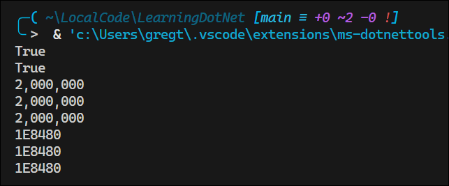

#### Storing Real Numbers

Computers cannot always represent real numbers exactly. For example, the decimal number `0.1` cannot be represented exactly in binary. This is because `0.1` is a repeating decimal in binary, just like `1/3` is a repeating decimal in decimal.

Most programming languages implement the IEEE 754 standard for floating-point arithmetic, introduced in 1985.

The following table shows how the number `12.75` is represented in binary:

| 128 | 64  | 32  | 16  | 8   | 4   | 2   | 1   |     | 1/2 | 1/4 | 1/8 | 1/16 |
| --- | --- | --- | --- | --- | --- | --- | --- | --- | --- | --- | --- | ---- |
| 0   | 0   | 0   | 0   | 1   | 1   | 0   | 0   | .   | 1   | 1   | 0   | 0    |

Note the bits with the value `1` in the 8, 4, 1/2, and 1/4 columns.

8 + 4 + 0.5 + 0.25 = 12.75

So, `12.75` in decimal notation is `000011.1100` in binary notation.

In this case, `12.75`  can be exactly represented in binary. However, most numbers can't.

#### Exploring Number Sizes
Use the `sizeof` operator to determine the size of a type in bytes.

```csharp
Console.WriteLine($"int uses {sizeof(int)} bytes and can store numbers from {int.MinValue:N0} to {int.MaxValue:N0}.");
Console.WriteLine($"double uses {sizeof(double)} bytes and can store numbers from {double.MinValue:N0} to {double.MaxValue:N0}.");
Console.WriteLine($"decimal uses {sizeof(decimal)} bytes and can store numbers from {decimal.MinValue:N0} to {decimal.MaxValue:N0}.");
```

**Output**:  
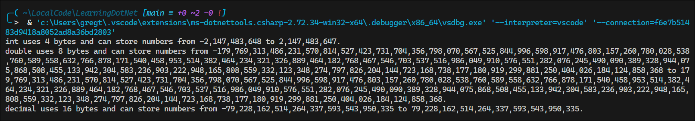

An `int` uses 4 bytes and can store positive or negative numbers up to about 2 billion. A `double` uses 8 bytes and can store much bigger values. A `decimal` uses 16 bytes and can store very large numbers, but not as big as a `double`. 

#### Comparing Double and Decimal Types

##### Comparing `double` Values

```csharp
Console.WriteLine("Using doubles:");
double a = 0.1;
double b = 0.2;
if (a + b == 0.3)
{
    Console.WriteLine($"{a} + {b} equals {0.3}");
}
else
{
    Console.WriteLine($"{a} + {b} does NOT equal {0.3}");
}
```

**Output**:  
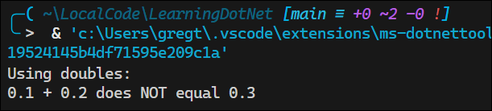

Why doesn't `0.1 + 0.2` equal `0.3`?

The `double` type cannot represent `0.1` exactly in binary, so the result of `0.1 + 0.2` is not exactly `0.3`. Instead, it is a number very close to `0.3`, but not exactly equal to it.

If you were to try values, like `0.1 + 0.3 == 0.4`, you would find that it does equal `0.4`. This is because `0.3` can be represented exactly in binary.

You can compare real numbers using the `float` type, which is less accurate than the `double` type, and the result would be `true`, but only b ecause of that lower accuracy.

```csharp
float a = 0.1f;
float b = 0.2f;
if (a + b == 0.3f) // True because float is less "accurate" than double
...
```

As a rule of thumb, only use `double` when accuracy, especially when comparing the equality of two numbers, is not important. 

The problem in the preceeding code deals with how the computer stores `0.1` in binary notation:


| 4   | 2   | 1   |     | 1/2 | 1/4 | 1/8 | 1/16 | 1/32 | 1/64 | 1/128 | 1/256 | 1/512 | 1/1024 | 1/2048 |
| --- | --- | --- | --- | --- | --- | --- | ---- | ---- | ---- | ----- | ----- | ----- | ------ | ------ |
| 0   | 0   | 0   | .   | 0   | 0   | 0   | 1    | 1    | 0    | 0     | 1     | 1     | 0      | 0      |

Note how the `1`'s after the decimal point repeat.

**Good Practice:** Never compare `double` values using `==`.

##### Comparing `decimal` Values

```csharp
Console.WriteLine("Using decimals:");
decimal c = 0.1M; // M suffix makes it a decimal literal
decimal d = 0.2M;
if (c + d == 0.3M)
{
    Console.WriteLine($"{c} + {d} equals {0.3M}");
}
else
{
    Console.WriteLine($"{c} + {d} does NOT equal {0.3M}");
}
```
**Output**:  
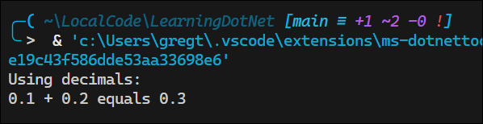

The `decimal` type can represent `0.1` exactly in binary, so the result of `0.1 + 0.2` is exactly `0.3`.

**Good Practice:** Use `int` for whole numbers, `double` that will not be compared with `==`, and `decimal` for money, engineering, and wherever the accuracy of a real number is important.

#### Special Real Numbers

The `float` and `double` have some useful special values:
- `NaN`: represents "Not a Number". This is the result of dividing zero by zero, or taking the square root of a negative number.
- `Epsilon`: the smallest number that can be stored in a `float` or `double` that is not zero. This is useful for comparing two numbers to see if they are "close enough" to be considered equal.
- `PostiveInfinity`: represents positive infinity. This is the result of dividing a positive number by zero.
- `NegativeInfinity`: represents negative infinity. This is the result of dividing a negative number by zero.

```csharp
#region Special float and double values
Console.WriteLine($"double.Epsilon: {double.Epsilon}"); // 4.94065645841247E-324
Console.WriteLine($"double.Epsilon to 324 decimal places: {double.Epsilon:N324}"); // 0.
Console.WriteLine($"double.Epsilon to 330 decimal places: {double.Epsilon:N330}"); // 0.
const int col1 = 37; // First column width
const int col2 = 6; // Second column width
string line = new string('-', col1 + col2 + 3);
Console.WriteLine(line);
Console.WriteLine($"{"Expression",-col1} | {"Value",col2}");
Console.WriteLine(line);
Console.WriteLine($"{"double.NaN",-col1} | {double.NaN,col2}");
Console.WriteLine($"{"double.PositiveInfinity",-col1} | {double.PositiveInfinity,col2}");
Console.WriteLine($"{"double.NegativeInfinity",-col1} | {double.NegativeInfinity,col2}");
Console.WriteLine(line);
Console.WriteLine($"{"0.0 / 0.0",-col1} | {0.0 / 0.0,col2}");
Console.WriteLine($"{"3.0 / 0.0",-col1} | {3.0 / 0.0,col2}");
Console.WriteLine($"{"-3.0 / 0.0",-col1} | {-3.0 / 0.0,col2}");
Console.WriteLine($"{"3.0 / 0.0 == double.PositiveInfinity",-col1} | {3.0 / 0.0 == double.PositiveInfinity,col2}");
Console.WriteLine($"{"-3.0 / 0.0 == double.NegativeInfinity",-col1} | {-3.0 / 0.0 == double.NegativeInfinity,col2}");
Console.WriteLine($"{"0.0 / 3.0",-col1} | {0.0 / 3.0,col2}");
Console.WriteLine($"{"0.0 / -3.0",-col1} | {0.0 / -3.0,col2}");
Console.WriteLine(line);
#endregion
```

**Output**:  
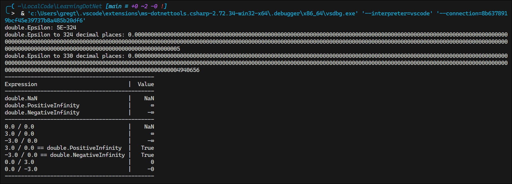

Things to note:
- `NaN` outputs as `NaN`.
- `PositiveInfinity` outputs as `∞`.
- `NegativeInfinity` outputs as `-∞`.
- Zero divided by any positive real number is zero.
- Zero divided by any negative real number is negative zero.
- `Epsilon` is slightly less than `5E-324` represented in scientific notation. This is the smallest number that can be stored in a `double` that is not zero.

#### New Number Types and Unsafe Code

The `System.Half` type was introduced in .NET 5. Like `float` and `double`, it can store real numbers, but normally only uses 2 bytes of memory. This is useful for storing large arrays of numbers, such as in graphics processing.

The `System.Int128` and `System.UInt128` types were introduced in .NET 7. These types can store very large whole numbers and normally use 16 bytes of memory. This is useful for storing large numbers, such as in cryptography.

For these number types, the `sizeof` operator can be used to determine the size of the type in bytes.

```csharp
unsafe
{
    Console.WriteLine($"Half uses {sizeof(Half)} bytes and can store numbers from {Half.MinValue:N0} to {Half.MaxValue:N0}.");
    Console.WriteLine($"Int128 uses {sizeof(Int128)} bytes and can store numbers from {Int128.MinValue:N0} to {Int128.MaxValue:N0}.");
}

```

**Output**:  
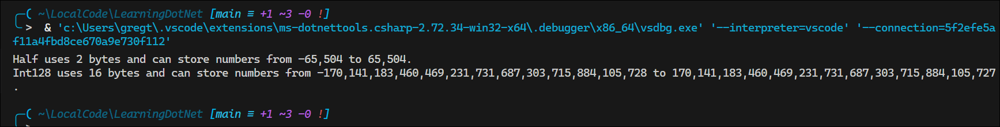

**Note:**: To run unsafe code, you need to set the `AllowUnsafeBlocks` property to `true` in the `.csproj` file.

```xml
<Project Sdk="Microsoft.NET.Sdk">
  <PropertyGroup>
    <OutputType>Exe</OutputType>
    <TargetFramework>net9.0</TargetFramework>
    <ImplicitUsings>enable</ImplicitUsings>
    <Nullable>enable</Nullable>
    <AllowUnsafeBlocks>true</AllowUnsafeBlocks>
  </PropertyGroup>
</Project>
```
See [Unsafe Code](https://learn.microsoft.com/en-us/dotnet/csharp/language-reference/unsafe-code) for more information.

### Storing Booleans

A `bool` is assigned using the keywords `true` or `false`.

```csharp
bool happy = true;
bool sad = false;
```

### Storing any type of object

A special type called `object` can store any type of object, but its flexibility comes at the cost of messier code and possible poor performance. For those two reasons, avoid using `object` unless you have a good reason to do so. 

```csharp
object height  = 1.88;                   // storing a double in an object
object name    = "Amir";                 // storing a string in an object
Console.WriteLine($"{name} is {height} meteres tall.");
int    length1 = name.Length;            // compiler error: name is an object, not a string
int    length2 = ((string)name).Length;  // casting the object to a string
Console.WriteLine($"{name} has {length2} characters.");
```

The `object` type has been available since C# 1.0, but C# 2 and later have a better alternative called **generics** that provides the flexibility we want without the performance overhead of `object`. 

#### Storing dynamic types

The `dynamic` type, introduced in C# 4, can also store any type of data, but even more than `object`, it's flexibility comes at the cost of performance.

Unlike `object`, the value stored the variable can have its members invoked without an explicit cast.

```csharp
dynamic something;
// Storing an array of int values in a dynamic object.
// An array of any type has a Length property.
something = new[] { 3, 5, 7 };

// Storing an int in a dynamic object.
// int does not have a Length property.
something = 12;

// Storing a string in a dynamic object.
// string has a Length property.
something = "Ahmed";

// This compiles, but might throw a runtime exception if something is not a string.
Console.WriteLine($"The length of something is {something.Length}.");

// Ouptut the type of the something variable.
Console.WriteLine($"The type of something is {something.GetType()}.");
```
**Output**:  
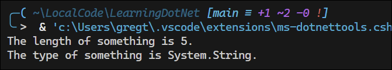<br>

In commenting out the statement assigning `something` to a string, the program would throw a runtime exception because `something` is not a string; it is now an `int`:

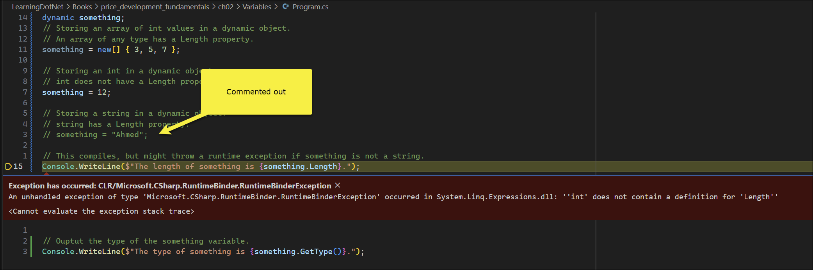</br>

When commenting out the statements that assign `something` to a string and an `int`, leaving the assignment to an array of `int` values, the program runs because the array has a `Length` property:

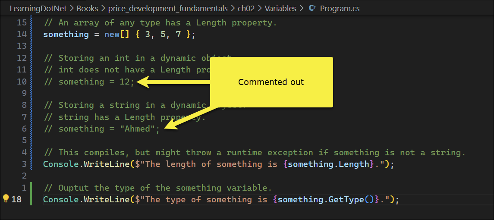</br>

**Output:**  
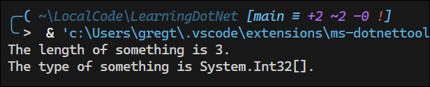</br>

One limitation of `dynamic` is that code editors cannot show Intellisense to help you write the code. This is because the compiler does not know what type of object is stored in the `dynamic` variable until runtime. Instead, the CLR (Common Language Runtime) checks for the member at runtime and throws an exception if it is missing.

Dynamic types are most useful when interoperating with non-.NET systems, e.g. working with a class library written in F#, Python, or JavaScript.
You might also need to interop with technologies like COM (Component Object Model), for example, when automating Excel or Word.

### Declaring local variables

Value types are released while reference types must wait for garbage collection.

##### Specifying the type of a local variable

```csharp
int     population = 67_000_000;  // 67 million in UK
double  weight     = 1.88;        // in kg
decimal price      = 4.99M;       // in pounds sterling. The M suffix indicates a decimal value.
string  fruit      = "Apples";    // string values use double quotes
char    letter     = 'Z';         // char values use single quotes
bool    happy      = true;        // Boolean values can be true or false
```

##### Inferring the type of a local variable

Use the `var` keyword to declare local variables with C# 3 and later. The compiler infers the type of the variable from the value assigned to it. This happens at compile time, so `var` has no effect on runtime performance. 

A literal number number without a decimal point is an `int` type. For other number types, you can use:
- `L`: Compiler infers `long`
- `UL`: Compiler infers `ulong`
- `M`: Compiler infers `decimal`
- `D`: Compiler infers `double`
- `F`: Compiler infers `float`

A literal number with a decimal point is inferred as a `double` type. To infer a `float`, you must use the `F` suffix.

Declarations from the previous section can be rewritten using `var`:

```csharp
var population = 67_000_000;  // 67 million in UK
var weight     = 1.88;        // in kg
var price      = 4.99M;       // in pounds sterling. The M suffix indicates a decimal value.
var fruit      = "Apples";    // string values use double quotes
var letter     = 'Z';         // char values use single quotes
var happy      = true;        // Boolean values can be true or fals
```
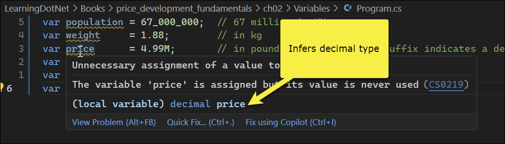


```csharp
using System.Xml;

// Good use of var because it avoids the repeated type as shown inthe more verbose second statement
var xml1 = new XmlDocument();           // Works with C# 3 and later
XmlDocument xml2 = new XmlDocument();   // Works with all versions of C#

// Bad use of var because we cannot tell the type, so we should use a specific type declaration as shown in the second
// statement
var file1 = File.CreateText("something1.txt");
StreamWriter file2 = File.CreateText("something2.txt");
```

Use `var` when the type is obvious from the right-hand side of the assignment. Avoid using `var` when the type is not obvious, such as when using LINQ queries or when calling methods that return `object` or `dynamic` types.

`var` is converted to the actual type by the compiler when you build the project. A variable declared using `var` has a specific, known, fixed data type. This differs from `dynamic`, which the compiler does not change; it remains a `System.Dynamic` type that can reference any object of any type. The actual type is only checked at runtime.

##### What does `new` do?

The `new` keyword allocates or initializes memory.

There are two categories of types in C#:
- Value types
- Reference types

Value types are simple and do not need to use the `new` keyword to explicitly allocate memory. But value types can use the `new` keyword to initialize their value. This is useful when there is no way to use a literal to set the value.

Reference types are more complex and need to use the `new` keyword to explicitly allocate memory. At the same time, they can use the `new` keyword to initialize their state.

When you declare variables, space is only allocated in memory for value types like `int` and `DateTime` but not for reference types like `Person`.

```csharp
/* Value types have memory allocated on the stack automatically. */
short    age;         // Allocates 2 bytes on the stack to store a System.Int16 value.
long     population;  // Allocates 8 bytes on the stack to store a System.Int64 value.
DateTime birthDate;   // Allocates 8 bytes on the stack to store a System.DateTime value.
Point    location;    // Allocates 8 bytes on the stack to store a System.Drawing.Point value.

/* Reference types will only have memory allocated on the heap when new is used (but they automatically have some memory
allocated on the stack to store information about themselves including the memory address of the object on the heap). */
Person bob;  // Allocates memory on the stack that can point to a Person object in the heap. Initially, bob will have the value null. null.
```
**Note:**  
- `age` has a value of `0` and 2 bytes of memory allocated on the stack.
- `population` has a value of `0` and 8 bytes of memory allocated on the stack.
- `birthDate` has a value of `01/01/0001` and 8 bytes of memory allocated on the stack.
- `location` has a value of `0,0` and 8 bytes of memory allocated on the stack.
- `bob` has a value of `null` and 4 bytes have been allocated on stack memory. No heap memory has been allocated for the object.

```csharp
age        = 45;                      // Initialize this variable to 45 using a literal value
population = 68_000_000;              // Initialize this variable to 68 million using a literal value
birthdate  = new(1995, 2, 23);        // Initialize this variable to February 23, 1995. C# does not support literal values for date/time values, so we must use `new`
location   = new(10, 20):             // Initialize the X and Y coordinates of this value type
bob        = new();                   // Allocate memory on the heap to store a Person. Any state will have default values. bob is no longer null.
bob        = new("Bob", "Smith", 45)  // Allocate memory on the heap to store a Person and initialize state. bob is no longer null.
 
// Older syntax with explicit types
birthdate = new DateTime(1995, 2, 3);
location = new Point(10, 20);
bob = new Person();
bob = new Person("Bob", "Smith", 45);
```
**Note:**
- `age`, `population`, and `birthdate` have already had memory allocated for them on the stack. The `new` keyword is used to initialize their values if you want them to be different from the default values.
- `bob` must use `new` to allocate heap memory for the object. The `=` assignment stores the memory address of that allocated memory on the stack. 

##### Using target-typed `new` to instantiate objects

Starting with C# 9, you can specify the tyep of the object first and then use `new` without repeating the type:

```csharp
XmlDocument xml3 = new();                   // Works with C# 9 and later
XmlDocument xml4 = new XmlDocument();       // Works with all versions of C#
```

If you have a type with a field or property that needs to be set, then the type can be inferred:

```csharp
Person kim = new();
kim.BirthDate = new(1967, 12, 26);          // Inferring the BirthDate property
class Person
{
    public DateTime BirthDate;
}
```
This way of instantiating objects is useful with arrays and collections because they have multiple objects, often of the same type:

```csharp
List<Person> people = new();                // instead of: new List<Person>()
{
    new() { FirstName = "Alice" },          // instead of: new Person() {...}
    new() { FirstName = "Bob" },            
    new() { FirstName = "Charlie" }
};
```

### Getting and setting the default value for types

Most of the primitive types except `string` are value types, which means they must have a value.

Use the `default()` operator to determine the default value for a type. You can then assign the default value of that type by using the `default` keyword:

```csharp
// Exploring default values
Console.WriteLine($"default(int) = {default(int)}");
Console.WriteLine($"default(bool) = {default(bool)}");
Console.WriteLine($"default(DateTime) = {default(DateTime)}");
Console.WriteLine($"default(string) = {default(string) ?? "<NULL>"}");      // ?? means "if null, use this value instead"
```
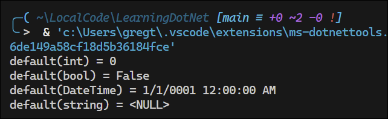</br>

The `string` type is a reference type, which means that `string` variables contain the memory address of a value, not the value itself. A reference type can have a `null` value, which is a literal that indictes the variable does not reference anything yet. `null` is the default for all reference types.

You can assign a type's default value to a variable using the `default` keyword:

```csharp
int number = 13;
Console.WriteLine($"number set to {number}");   // Number set to 13
number = default;
Console.WriteLine($"number set to {number}");   // Number set to 0
```

### Exploring more about console apps

#### Displaying output to the user

Use the `Write` method when you want to print something without a carriage return:

```csharp
Console.Write("A");
Console.Write("B");
Console.Write("C");
```
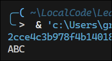</br>

Use `WriteLine` when you want to print something with a carriage return:

```csharp
Console.WriteLine("A");
Console.WriteLine("B");
Console.WriteLine("C")
```
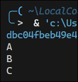</br>

#### Formatting using numbered positional arguments

The `Write`, `WriteLine`, and `Format` methods can have up to three numbered arguments, named `arg0`, `arg1`, and `arg2`. If you need to pass more than three arguments, then you can not name name.

```csharp
using System.Globalization;     // For CultureInfo
CultureInfo.CurrentCulture = CultureInfo.GetCultureInfo("en-US");
int numberOfApples = 12;
decimal pricePerApple = 0.35M; // M indicates a decimal literal

Console.WriteLine(
    format: "{0} apples cost {1:C}",
    arg0: numberOfApples,
    arg1: pricePerApple * numberOfApples
);

string formatted = string.Format(
    format: "{0} apples cost {1:C}",
    arg0: numberOfApples,
    arg1: pricePerApple * numberOfApples
);
// WriteToFile(formatted); // Writes the string to a file
```
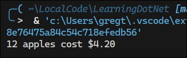</br>

```csharp
// Three parameter values can use named arguments
Console.WriteLine(
    format: "{0} {1} lived in {2}",
    arg0: "Roger", arg1: "Cevung", arg2: "Stockholm");

// Four or more parameter values cannot use named arguments
Console.WriteLine(
    "{0} {1} lived in {2} and worked in {3} team at {4}",
    "Roger", "Cevung", "Stockholm", "Education", "Optimizely");
```
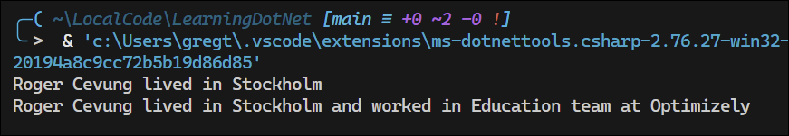</br>

#### Formatting using interpolated strings

```csharp
// The following statement must be all on one line when using C# 10 or earlier. If using C# 11 or later, it can be split
//across multiple lines, but  the break must in the middle of an expression.
Console.WriteLine($"{numberOfApples} apples cost {pricePerApple
    * numberOfApples:C}");
```

Before C# 10, `string` constants could only be combined using the `+` operator:

```csharp
private const string firstname = "Omar";
private const string lastname = "Rudberg";
private const string fullname = firstname + " " + lastname;
```

With C# 10 and later, you can use interpolated strings to combine string constants:

```csharp
private const string fullname = $"{firstname} {lastname}";
```
**Note:** This only works for string constants. It cannot work with other types like numbers, which require data type conversions.

#### Understanding format strings

A variable or expression can be formatted using a format string after a comma or colon.

Format string options:
- `N0`: Number with thousands separator and no decimal places
- `N2`: Number with thousands separator and two decimal places
- `C`: Currency (determined by the current culture)

The full syntax is:

```csharp
{index[,alignment][:formatString]}
```

**Alignment:** 
- The alignment is the number of spaces within a width of characters.
- Useful when outputting tables of values, some of which might be left- or right-aligned.
- Positive integers mean right-aligned; negative integers mean left-aligned.

```csharp
string applesText = "Apples";
int applesCount = 1234;
string bananasText = "Bananas";
int bananasCount = 56789;

Console.WriteLine();
Console.WriteLine(
    format: "{0,-10} {1,6}",
    arg0: "Name", arg1: "Count");
Console.WriteLine(
    format: "{0,-10} {1,6:N0}",
    arg0: applesText, arg1: applesCount
);
Console.WriteLine(
    format: "{0,-10} {1,6:N0}",
    arg0: bananasText, arg1: bananasCount
);
```
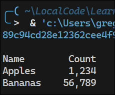</br>

#### Custom Number Formatting

```csharp
decimal value = 0.325M;
Console.WriteLine("Currency: {0:C}, Percentage: {0:0.0%}", value);
```
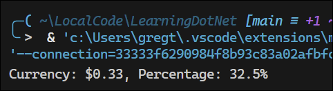</br>

**Standard Numeric Format Codes:**  

| **Format Code** | **Description**                                                                                                     |
| --------------- | ------------------------------------------------------------------------------------------------------------------- |
| `C` or `c`      | **Currency.** In US culture, `C` formatting the value `123.4` gives `$123.40`, and `C0` formatting gives `$123`.    |
| `N` or `n`      | **Number.** Integer digits with an optional negative sign and grouping characters.                                  |
| `D` or `d`      | **Decimal.** Integer digits with an optional negative sign but **no** grouping characters.                          |
| `B` or `b`      | **Binary.** `B` formatting the value `13` gives `1101`, and `B8` formatting the value `13` gives `00001101`.        |
| `X` or `x`      | **Hexadecimal.** `X` formatting the value `255` gives `FF`, and `X4` formatting the value `255` gives `00FF`.       |
| `E` or `e`      | **Exponential notation.** `E` formatting the value `1234.567` gives `1.234567000E+003`, and `E2` gives `1.23E+003`. |


**Custom Numeric Format Codes:**  

| **Format Code** | **Description**                                                                                                                                                                                                                                                                                            |
| --------------- | ---------------------------------------------------------------------------------------------------------------------------------------------------------------------------------------------------------------------------------------------------------------------------------------------------------- |
| `0`             | Zero placeholder. Replaces the zero with the corresponding digit if present; otherwise, it uses zero. Example: `0000.00` formatting the value `123.4` would give `0123.40`.                                                                                                                                |
| `#`             | Digit placeholder. Replaces the hash with the corresponding digit if present; otherwise, it uses nothing. Example: `####.##` formatting the value `123.4` would give `123.4`.                                                                                                                              |
| `.`             | Decimal point. Sets the location of the decimal point in the number. Respects culture formatting, so it is a `.` (dot) in US English but a `,` (comma) in French.                                                                                                                                          |
| `,`             | Group separator. Inserts a localized group separator between each group. Also used to scale a number by multiples of 1,000 for each comma. Example: `0,000`formatting `1234567` gives `1,234,567`. Example: `0.00,,` formatting `1234567` gives `1.23` because the two commas mean divide by 1,000 twice. |
| `%`             | Percentage placeholder. Multiplies the value by 100 and adds a percentage character.                                                                                                                                                                                                                       |
| `\`             | Escape character. Makes the next character a literal instead of a format code. Example: `\#\,###\#` formatting the value `1234` gives `#1,234#`.                                                                                                                                                           |
| `;`             | Section separator. Defines different format strings for positive, negative, and zero numbers. Example: `[0];(0);Zero` formatting `13` gives `[13]`, `-13` gives `(13)`, and `0` gives `Zero`.                                                                                                              |
| **Others**      | All other characters are shown in the output as-is.                                                                                                                                                                                                                                                        |

**Standard Format Codes for Date and Time Values:**

| **Format Code** | **Description**                                                                                                                   |
| --------------- | --------------------------------------------------------------------------------------------------------------------------------- |
| `d`             | **Short date pattern.** Varies by culture. Example: `en-US` uses `M/d/yyyy`, `fr-FR` uses `dd/MM/yyyy`.                           |
| `D`             | **Long date pattern.** Varies by culture. Example: `en-US` uses `MMMM, MMMM d, yyyy`, `fr-FR` uses `mmmm, dd MMMM yyyy`.          |
| `f`             | **Full date/time pattern (short time).** Includes hours and minutes. Varies by culture.                                           |
| `F`             | **Full date/time pattern (long time).** Includes hours, minutes, seconds, and AM/PM. Varies by culture.                           |
| `m`, `M`        | **Month/day pattern.** Varies by culture.                                                                                         |
| `o`, `O`        | **Round-trip date/time pattern.** A standardized format suitable for serialization. Example: `2023-05-30T13:45:30.0000000-08:00`. |
| `r`, `R`        | **RFC1123 pattern.**                                                                                                              |
| `t`             | **Short time pattern.** Varies by culture. Example: `en-US` uses `h:mm tt`, `fr-FR` uses `HH:mm`.                                 |
| `T`             | **Long time pattern.** Varies by culture. Example: `en-US` uses `h:mm:ss tt`, `fr-FR` uses `HH:mm:ss`.                            |
| `u`             | **Universal sortable date/time pattern.** Example: `2009-06-15 13:45:30Z`.                                                        |
| `U`             | **Universal full date/time pattern.** Varies by culture. Example: `en-US` might be `Monday, June 15, 2009 8:45:30 PM`.            |

**Custom Format Codes for Date and Time Values:**

| **Format Code**  | **Description**                                                                                                           |
| ---------------- | ------------------------------------------------------------------------------------------------------------------------- |
| `/`              | **Date part separator.** Varies by culture. Example: `en-US` uses `/`, `fr-FR` uses `-`.                                  |
| `\`              | **Escape character.** Allows formatting special characters literally. Example: `h\h m\m` formats `9:30 AM` as `9 h 30 m`. |
| `:`              | **Time part separator.** Varies by culture. Example: `en-US` uses `:`, `fr-FR` uses `.`.                                  |
| `d`, `dd`        | **Day of the month.** From `1` to `31`, or `01` to `31` with leading zero.                                                |
| `ddd`, `dddd`    | **Day of the week.** Abbreviated (`Mon`) or full (`Monday`) name, localized to current culture.                           |
| `f`, `ff`, `fff` | **Fractions of a second.** Tenths, hundredths, or milliseconds.                                                           |
| `g`              | **Era.** Example: `A.D.`                                                                                                  |
| `h`, `hh`        | **Hour (12-hour clock).** From `1` to `12`, or `01` to `12` with leading zero.                                            |
| `H`, `HH`        | **Hour (24-hour clock).** From `0` to `23`, or `01` to `23` with leading zero.                                            |
| `K`              | **Time zone info.** `null` for unspecified, `Z` for UTC, or value like `-8:00` for offset.                                |
| `m`, `mm`        | **Minute.** From `0` to `59`, or `00` to `59` with leading zero.                                                          |
| `M`, `MM`        | **Month (number).** From `1` to `12`, or `01` to `12` with leading zero.                                                  |
| `MMM`, `MMMM`    | **Month (name).** Abbreviated (`Jan`) or full (`January`) name, localized to culture.                                     |
| `s`, `ss`        | **Second.** From `0` to `59`, or `00` to `59` with leading zero.                                                          |
| `t`, `tt`        | **AM/PM designator.** First (`A`) or both characters (`AM`).                                                              |
| `y`, `yy`        | **Year (2-digit).** Year of current century, from `0` to `99` or `00` to `99`.                                            |
| `yyy`            | **Year (3+ digits).** Minimum of 3 digits. Examples: `001` for 1 A.D., `410`, `2016`.                                     |
| `yyyy`, `yyyyy`  | **Full year.** Four- or five-digit year.                                                                                  |
| `z`, `zz`        | **UTC offset (hours).** Hours offset from UTC, with or without leading zeros.                                             |
| `zzz`            | **UTC offset (hours and minutes).** With leading zero. Example: `+04:30`.                                                 |


### Getting text input from the user

Use the `ReadLine` method to get text input from the user. This method waits for the user to type something and press Enter, then returns the text as a string.

```csharp
Console.Write("Type your first name and press ENTER: ");
string firstName = Console.ReadLine();
Console.Write("Type your age and press ENTER: ");
string age = Console.ReadLine();
Console.WriteLine($"Hello {firstName}, you look good for {age}.");
```
By default, nullability checks are enabled, so the C# compiler gives two warnings that `ReadLine` could return a `null` value instead of a `string` value:

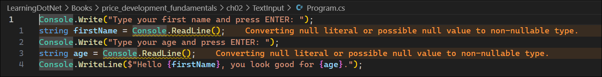

To address this, you can use either of two methods to switch off these specific warnings:

```csharp
Console.Write("Type your first name and press ENTER: ");
string? firstName = Console.ReadLine();                             // Use of the nullable refernce type annotation
Console.Write("Type your age and press ENTER: ");
string age = Console.ReadLine()!;                                   // Use of the null-forgiving operator
Console.WriteLine($"Hello {firstName}, you look good for {age}.");
```

The nullable reference type annotation `string?` tells the compiler we are expecting a possible `null` value, so it does not need to warn us. If the variable is `null`, then when it is later output with `WriteLine`, it will just be blank. If you were going to access any members of the `firstName` variable, then you would need to check for `null` first.

The null-forgiving operator, `!`, tells the compiler that, in this case, `ReadLine` will not return `null`, so it can stop showing the warning. It is our responsibility to ensure that this is the case. In this case, the `Console` type's implementation of `ReadLine` always returns a `string`, even if it is just an empty `string` value.


| Feature                       | Symbol | Meaning                            | Compiler Behavior                               |
| ----------------------------- | ------ | ---------------------------------- | ----------------------------------------------- |
| Nullable reference annotation | `?`    | This variable **can be null**      | Gives warnings when dereferenced without checks |
| Null-forgiving operator       | `!`    | “This value isn’t null, I promise” | Silences nullability warnings                   |


#### When does `ReadLine` return `null`?

In typical console apps, `ReadLine` returns `null` only if the **end of stream (EOF)** is reached. This is not something that can be achieved by user input in a standard console environment since EOF is typically signaled by the console being closed or redirected input being fully consumed.

In the context of the following code:

```csharp
string? name = ReadLine();  // Prompt user to enter their name
```

Here are the conditions  under which `name` could be `null`:
- If the standard input stream is redirected and reaches EOF
- If you are testing in an environment where you can simulate EOF, like some development environments or automated testing setups

Under normal user input conditions, `null` will never be returned by the `ReadLine` method.

### Simplifying the usage of the console

#### Importing a static type for a single file

The `using` statement can be used to import a namespace and it can also be used to simplify code by importing a static class. For example, you can import the `System.Console` class to avoid having to type `Console.` every time you want to use a method from that class.

```csharp
using static System.Console;                            // Using static to simplify Console calls

Write("Type your first name and press ENTER: ");        // No longer need to specify Console.Write
string? firstName = Console.ReadLine();
Write("Type your age and press ENTER: ");
string age = Console.ReadLine()!;
WriteLine($"Hello {firstName}, you look good for {age}.");
```

#### Importing a static type for all code files in a project

Instead of specifying `using static System.Console;` in every code file, you can add it to the `.csproj` file to apply it to all code files in the project:

```xml
<Project Sdk="Microsoft.NET.Sdk">
  <PropertyGroup>
    <OutputType>Exe</OutputType>
    <TargetFramework>net9.0</TargetFramework>
    <ImplicitUsings>enable</ImplicitUsings>
    <Nullable>enable</Nullable>
  </PropertyGroup>

  <ItemGroup Label="Simplify console app">
    <Using Include="System.Console" Static="true" />    <!-- Importing System.Console as a static type for all code files in the project -->
  </ItemGroup>

</Project>
```

> The `Label` attribute within an `<ItemGroup>` is optional but useful for several reasons. Labels provide a clear indication  of what each group contains. Using labels, you can conditionally include or exclude certain items based on build configurations or other conditions.


### Getting key input from the user

Use the `ReadKey` method to get a single key press from the user. This method waits for the user to press a key or key combination, which is then returned as a `ConsoleKeyInfo` object. This object contains information about the key pressed, including the key itself, any modifier keys (like Shift or Ctrl), and whether the key was pressed or released.

```csharp
Write("Press any key combination: ");
ConsoleKeyInfo key = ReadKey();
WriteLine();
WriteLine("Key: {0}, Char: {1}, Modifiers: {2}",
    arg0: key.Key, arg1: key.KeyChar, arg2: key.Modifiers);
```
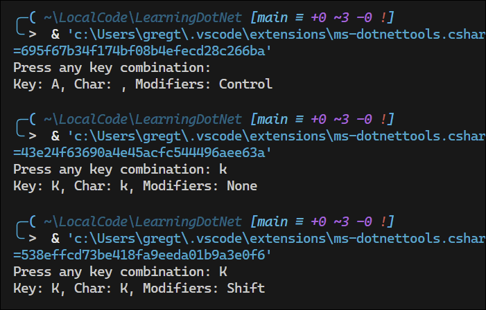

### Passing arguments to a console app

Prior to .NET 6, the console app project template made it obvious how to pass arguments to a console app by including a `Main` method with a `string[] args` parameter. 

```csharp
using System;
namespace Arguments
{
  class Program
  {
    static void Main(string[] args)
    {
      Console.WriteLine("Hello World!");
    }
  }
}
```

In .NET 6 and later, with the use of the top-level statementsfeature, the `Program` class and the `Main` method are hidden, along with the declaration of the `args` array. The trick is you must know it still exists.

Command-line arguments are separated by spaces. Other characters, like hyphens and colons, are treated as part of an argument value.

To include spaces in an argument value, enclose the argument value in double quotes.

```csharp
WriteLine($"There are {args.Length} arguments.");
```
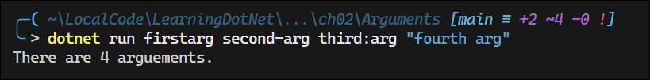

To enumerate through the arguments, you can use a `foreach` loop:

```csharp
foreach (string arg in args)
{
    WriteLine(arg);
}
```
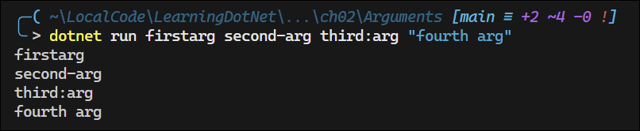

### Setting options with arguments

You can use arguments to set options for your console app. Given that you have statically imported the `System.Console` class, it has properties like `ForegroundColor` and `BackgroundColor`, and `CursorSize` that you can set without needing to prefix them with `Console`.

```csharp
if (args.Length < 3)
{
    WriteLine("You must specify two colors and a cursor size, e.g.");
    WriteLine("dotnet run red yellow 50");
    return;
}

ForegroundColor = (ConsoleColor)Enum.Parse(     // Convert the string argument to a ConsoleColor enum value
    enumType: typeof(ConsoleColor),
    value: args[0], ignoreCase: true);

BackgroundColor = (ConsoleColor)Enum.Parse(
    enumType: typeof(ConsoleColor),
    value: args[1], ignoreCase: true);

CursorSize = int.Parse(args[2]);
```
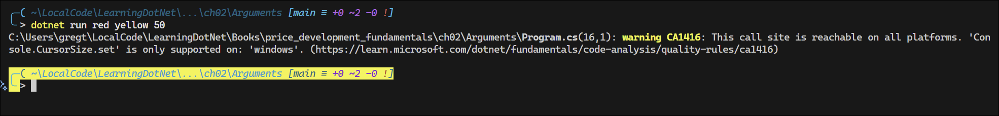
