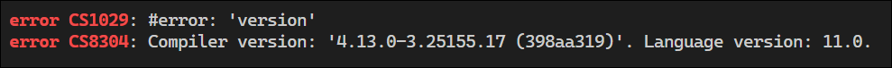
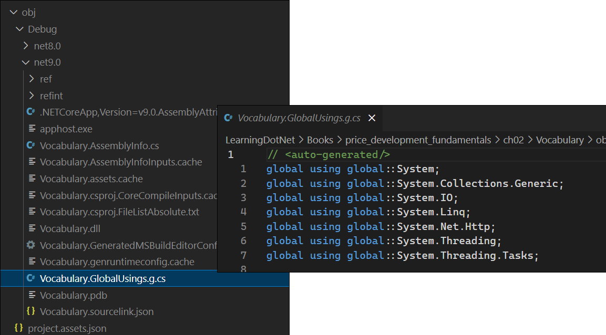
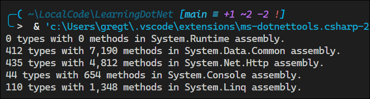

# C#13 and .NET 9 Modern Cross-Platform Development Fundamentals


<br>

<details>
<summary>Book Resources</summary>

- [Book source code](https://github.com/markjprice/cs13net9)
- [Answers to Test Your Knowledge questions](https://static.packt-cdn.com/downloads/9781835881224_Appendix.pdf?link_from_packtlink=yes)
- [Book Discord](https://packt.link/csharp13dotnet9)
- [Errata](https://github.com/markjprice/cs13net9/blob/main/docs/errata/README.md)
  
</details>


## Dotnet Commands

```cmd
# General info
dotnet --version         # Show the SDK version used by the current project
dotnet --info            # Show SDK and runtime versions
dotnet --list-sdks       # List all installed SDKs
dotnet --list-runtimes   # List all installed runtimes
dotnet new --list        # List all templates

# Solution and project setup

# Create a new solution named Chapter01
dotnet new sln --name Chapter01 

# Show help for console project template
dotnet new console --help                                        

# Create a new console app in the HelloCS folder
dotnet new console --output HelloCS                              

# Add HelloCS project to solution
dotnet sln add HelloCS                                           

# Create a new console app without using top-level statements
dotnet new console -o AboutMyEnvironment --use-program-main      

# Add AboutMyEnvironment project to solution
dotnet sln add .\AboutMyEnvironment\                             

# Build the solution or project
dotnet build                                                     

# Clean the solution or project
dotnet clean                                                     
```

## C# and .NET Resources
- [Official .NET versions](https://versionsof.net/)
- [C# Coding Conventions](https://learn.microsoft.com/en-us/dotnet/csharp/fundamentals/coding-style/coding-conventions)
- [Alpha .NET versions](https://github.com/dotnet/sdk/blob/main/documentation/package-table.md)
- [C# Language & Feature Timeline (Author's GitHub)](https://github.com/markjprice/cs13net9/blob/main/docs/ch02-features.md)
- [C# Version History](https://learn.microsoft.com/en-us/dotnet/csharp/whats-new/csharp-version-history)
- [Configure C# Language Version](https://learn.microsoft.com/en-us/dotnet/csharp/language-reference/configure-language-version?utm_source=chatgpt.com)
- [Configure Target Framework](https://learn.microsoft.com/en-us/dotnet/standard/frameworks?utm_source)


## Chapter 2: Speaking C#

### Determine the In-Use Language Version

You can verify the language version in use by including the `#error version`
preprocessor directive. See [Preprocessor
Directives](https://learn.microsoft.com/en-us/dotnet/csharp/language-reference/preprocessor-directives#error-and-warning-information).

Run `dotnet build` to see the error message.



### Implicitly and Globally Importing Namespaces

Traditionally, namespaces were needed in all `.cs` files:

```
using System;
using System.Linq;
using System.Collections.Generic;
```

Starting with .NET 6, you can use the `global using` directive to import namespaces globally, so that you don't have to include them in every file. 

```csharp
/// File: Program.cs
global using System;
global using System.Linq;
global using System.Collections.Generic;
```

The author recommends creating a dedicated `GlobalUsings.cs` file in the root of your project to contain all global usings.

Note that any project that targets .NET 6 or later, generates a `<Project-Name>.GlobalUsings.g.cs` file in the `obj` folder to implicitly globally import some common namespaces like `System`.



You can control which namespaces are imported by adding the `<ItemGroup>` element to your `.csproj` file:

```xml
<Project Sdk="Microsoft.NET.Sdk">
  <PropertyGroup>
    <OutputType>Exe</OutputType>
    <TargetFramework>net9.0</TargetFramework>
    <ImplicitUsings>enable</ImplicitUsings>
    <Nullable>enable</Nullable>
  </PropertyGroup>
  <ItemGroup>
    <Using Remove="System.Threading" />
    <Using Include="System.Numerics" />
    <Using Include="System.Console" Static="true" />
    <Using Include="System.Environment" Alias="Env" />
  </ItemGroup>
</Project>
```

Upon saving, changes to the `.csproj` file will automatically update the `obj/<Project-Name>.GlobalUsings.g.cs` file.

In the section above, the `System.Console` namespace is imported as a static class, allowing you to call its methods without specifying the class name. 

```csharp
// Instead of Console.WriteLine("Hello, World!");
WriteLine("Hello, World!");
```

To disable implicitly imported namespaces, set the `ImplicitUsings` property to `disable` in the `.csproj` file. You might choose to do this if you want to create a single file with all the `global using` statements. Author's recommendation is to keep it enabled and to change what is included in the auto-generated class file in the `obj` folder.

```xml
<Project Sdk="Microsoft.NET.Sdk">
  <PropertyGroup>
    <OutputType>Exe</OutputType>
    <TargetFramework>net9.0</TargetFramework>
    <ImplicitUsings>disable</ImplicitUsings>
    <Nullable>enable</Nullable>
  </PropertyGroup>
</Project>
```

See [Global Using Directives](https://learn.microsoft.com/en-us/dotnet/core/tutorials/top-level-templates#global-using-directives).

### Types vs Classes

The term **type** is often confused with **class**. In C#, every type can be classified as `class`, `enum`, `struct`, `interface`, or `delegate`. As an example, the C# keyword `string` is a `class`, but  `int` is a `struct`. 

The C# language only has a few keywords for types, and the C# language does not define any types. Rather, the .NET platform provides thousands of types to C#, including `System.Int32`, which is the C# keyword alias that `int` maps to.

The program [Types](./ch02/Types/Program.cs) reveals the extent of the C# vocabulary by showing the number of types available in the namespaces imported from the `.csproj` file.



### Storing Text

#### `char` and `string` Types
A `char` is assigned using single quotes.

```csharp
char letter = 'A';
char digit = '1';
char symbol = '$';
char userChoice = GetChar();
```

Note:
- Some chars, such as the Egyptian hieroglyph A002 (U+13001), need two `System.Char` values to represent them. This is called a surrogate pair.
- Do not always assume one `char` equals one letter!

A `string` is assigned using double quotes.

```csharp
string firstName = "Bob";
string lastName = "Smith";
string phoneNumber = "(215) 555-4256";
string horizontalLine = new('-', 50); // 50 dashes, assigning a string returned from the string class constructor
string address = GetAddressFromDatabase(id: 563);
string grinningEmoji = char.ConvertFromUtf32(0x1F600); // grinning face emoji, assigning an emoji by converting a Unicode code point to a string

```

#### Outputting Emojis
When outputting emojis, you must set the output encoding to UTF-8. This is done by setting the `Console.OutputEncoding` property to `System.Text.Encoding.UTF8`.

```csharp
Console.OutputEncoding = System.Text.Encoding.UTF8;
string grinningEmoji = char.ConvertFromUtf32(0x1F600); // grinning face emoji
Console.WriteLine(grinningEmoji); // Output: 😀
```

#### Verbatim Strings

Strings allow for the use of an escape sequence, which often start with a backslash, `\`, followed by one or more characters. 

```csharp
string fullNameWithTabSeparator = "Bob\tSmith"; // Bob and Smith separated by a tab character
```

**Issue:**  
What if you are storing the path to a file in Windows?

```csharp
string filePath = "C:\televisions\sony\bravia.txt"; // Issue: \t is interpreted as a tab character
```

To avoid this issue, you can use a verbatim string literal by prefixing the string with an `@` symbol. This tells the compiler to ignore escape sequences and treat the string as-is.

```csharp
string filePath = @"C:\televisions\sony\bravia.txt"; // Correct: \t is treated as a backslash followed by a t
```

> **Note**: With C# 13 and later, you can represent the ESC character (Unicode U+001B) using the `\e` escape sequence.

```csharp
// C# 13 and later
char esc = '\e'; // ESC character
// C# 12 and earlier
char esc = '\u001b'; // ESC character
```

#### Raw String Literals

Raw string literals, introduced in C# 11, allow you to create multi-line strings without needing to escape characters. This makes it useful to define literals containing other languages like XML, HTML, or JSON.

```csharp
string xml = """
	<person age="50">
		<first_name>Mark</first_name>
	</person>
	""";
```
The compiler looks at the indentation of the last three or more double quote characters, and then automatically removes the indentation from al
the content inside the raw string literal. The results of the string would not be indented as is in the defining code but, instead, will be aligned with the left margin.

**Result**: 

```xml
<person age="50">
	<first_name>Mark</first_name>
</person>
```

If the end three double quotes are aligned with the left margin, then the indentation would not be removed.

```csharp
string xml = """
	<person age="50">
		<first_name>Mark</first_name>
	</person>
""";
```

**Result**:

```xml
	<person age="50">
		<first_name>Mark</first_name>
	</person>
```

**Why three *or more* double quote characters?**

If the content itself has three double quotes, you can use four double quotes to indicate the start and end of the string. Where the content has four double quotes, you can use five double quotes, and so on. 

#### Raw Interpolated String Literals

You can mix interpolated strings that use curly braces `{}` with raw string literals. To do this, you specify the number of braces that indicate a replaced expression by adding the number of dollar signs `$` before the opening three double quotes. 

```csharp
var person = new { FirstName = "Greg", LastName = "Tate" };
string json = $$"""
	{
		"first_name": "{{person.FirstName}}",
		"last_name": "{{person.LastName}}"
	}
	""";
```

**Result**:

```json
{
	"first_name": "Greg",
	"last_name": "Tate"
}
```

The number of dollar signs tells the compiler how many braces are needed to become recognized as an interpolated expression.

### Storing Numbers

